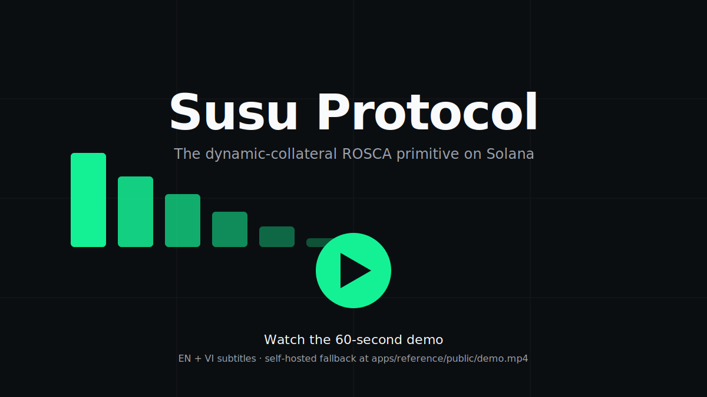
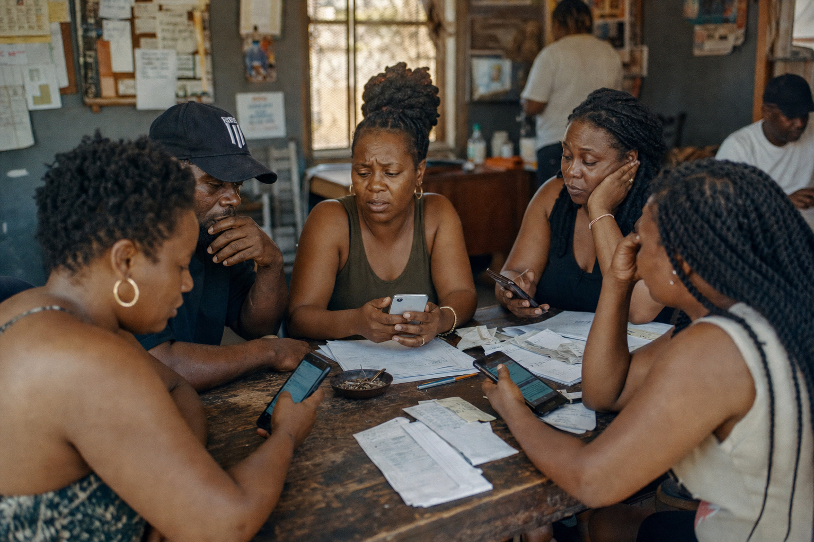
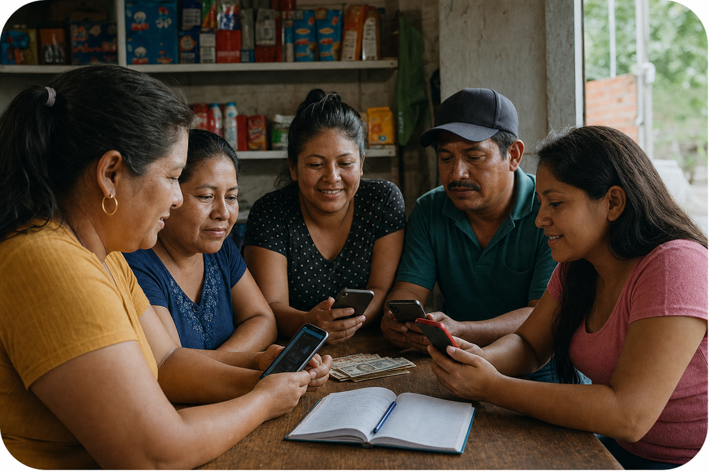
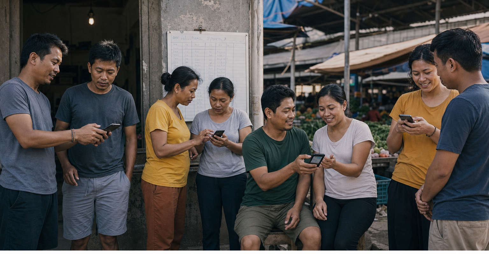
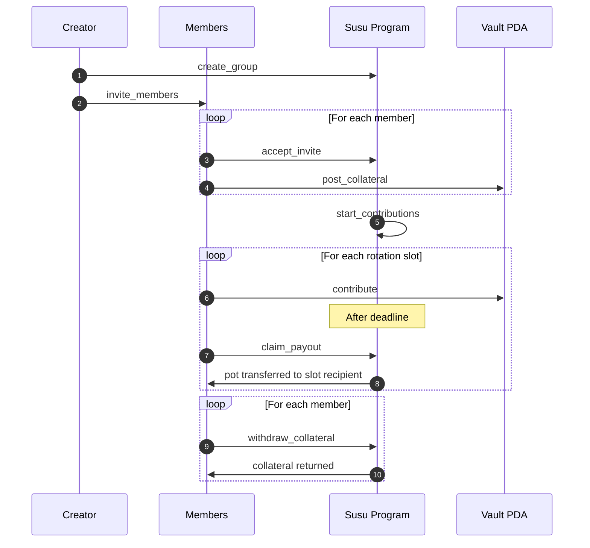
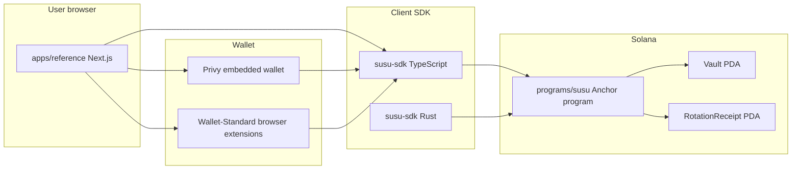

<!-- susu:hero:start -->
<!-- susu:hero:h1 -->
<p align="center">
  <picture>
    <source media="(prefers-color-scheme: dark)" srcset="https://img.shields.io/badge/Susu%20Protocol-14F195?style=for-the-badge&logoColor=white&label=&color=14F195&labelColor=14F195" />
    
  </picture>
</p>

<h1 align="center" style="font-family: Geist Display, system-ui, sans-serif; font-size: 56px; line-height: 64px; font-weight: 700; letter-spacing: -0.01em;">
  Susu Protocol
</h1>

<!-- susu:hero:subhead -->
<p align="center">
  <strong>The dynamic-collateral ROSCA primitive on Solana.</strong>
  <br />
  Public from commit zero. Auditable curve invariant. SDK-first integration paths.
</p>

<!-- susu:hero:badges -->
<p align="center">
  <a href="./docs/legal-engagement.md"></a>
  <a href="./LICENSE"></a>
  <a href="./programs/susu/"></a>
  <a href="./docs/"></a>
  <a href="./audits/adversary/adversary-report.json"></a>
  <a href="./docs/threat-model.md"></a>
  <a href="https://github.com/tantshirt/susu-monorepo/actions/workflows/ci.yml"></a>
</p>

<p align="center">

[](./docs/legal-opinion.pdf)

</p>

<!-- susu:hero:demo -->
### Local reference app and demo script

- **[Demo setup (`pnpm susu:demo`, env vars, airdrop recovery)](./docs/demo-setup.md)** — read this if `devnet-airdrop-limit` or Surfpool CI parity blocked you.
- **[Epic 9 mainnet gate checklist](./docs/epic9-mainnet-gate.md)** — audit/deploy/immutability (separate from devnet demos).

### One command to run the demo

Copy this into your terminal:

```bash
pnpm susu:demo
```

<sub>demo took $WALL_CLOCK_SECONDSs last verified at $COMMIT_SHA</sub>

<!-- susu:hero:watch-cta -->
<p align="center">
  <!-- TODO (Story 8.6 follow-up): replace TODO_youtube_id with the canonical YouTube ID after upload. The self-hosted fallback lives at apps/reference/public/demo.mp4 (Git LFS). Subtitles: apps/reference/public/demo.{en,vi}.vtt. -->
  <a href="https://www.youtube.com/watch?v=TODO_youtube_id">
    
  </a>
</p>
<p align="center"><sub>Self-hosted fallback: <a href="./apps/reference/public/demo.mp4"><code>apps/reference/public/demo.mp4</code></a> · subtitles: <a href="./apps/reference/public/demo.en.vtt">EN</a> · <a href="./apps/reference/public/demo.vi.vtt">VI</a></sub></p>

<!-- susu:hero:fork-cta -->
<p>
  <a href="https://github.com/tantshirt/susu-monorepo/fork"><strong>⑂ Fork on GitHub</strong></a>
  &nbsp;·&nbsp;
  <a href="./CONTRIBUTING.md">contribute</a>
  &nbsp;·&nbsp;
  <a href="./examples/">browse partner examples</a>
</p>

<!-- susu:hero:curve-hook -->
> **The novelty:** Susu uses a dynamic-collateral curve `C_i = contribution × (2n − 1 − i)` so that the recipient with the most to gain posts the most collateral. No rational defector profits at any rotation slot — proven by [10,000 adversarial circles](./audits/adversary/adversary-report.json) and a [property-test invariant](./docs/collateral-curve.md).

<!-- susu:hero:curve-svg -->
<p align="center">
  
</p>

<!-- susu:hero:end -->

<!-- susu:linkcluster:start -->

## Verify every claim

Every assertion in the hero above is one click from its verifier. If a link 404s, the [markdown-link-check workflow](./.github/workflows/markdown-link-check.yml) blocks the merge.

| Claim | Verifier |
| --- | --- |
| The dynamic-collateral curve has no rational defector | [`docs/collateral-curve.md`](./docs/collateral-curve.md) |
| 10,000 adversarial circles passed | [`audits/adversary/adversary-report.json`](./audits/adversary/adversary-report.json) |
| Legal posture documented | [`docs/legal-opinion.pdf`](./docs/legal-opinion.pdf) |
| Daily engineering log (latest entry) | [`log/latest.md`](./log/latest.md) |
<!-- susu:linkcluster:partner -->
| Ecosystem partner integration (placeholder until [Story 8.7](https://github.com/tantshirt/susu-monorepo/issues/89) confirms a real partner) | [`examples/with-privy/`](./examples/with-privy/) |
<!-- /susu:linkcluster:partner -->

<!-- susu:linkcluster:end -->

---

# Part 1 — What this is, in plain English

> If you have never touched Solana, never used a wallet, and just want to understand what Susu does and why it might matter — start here. Skip ahead to **Part 2** if you want code, architecture, and build instructions.

## What is Susu?

A **susu** (also called *tanda*, *hui*, *ajo*, *partner*, *chama*, or **ROSCA** — Rotating Savings and Credit Association) is one of the oldest savings tools humans have. The mechanic is simple:

> A small group of people each chips in the same amount every cycle. Every cycle, **one person takes the whole pot**. By the end of N cycles, everyone has gotten one full payout, and everyone has saved the same total — but each person also got an interest-free lump sum at some point along the way.

That's it. No bank. No interest. No credit score. Billions of people use susus today. Susus built diaspora wealth in the US, paid for weddings in West Africa, bootstrapped market stalls in Vietnam, and funded immigrant grocery stores in New York.

**Susu Protocol** is a Solana smart contract that lets a group of people run a susu on-chain — without trusting any single coordinator, without paying a custodian, and without a "ROSCA app company" sitting in the middle that could disappear with the funds.

<p align="center">
  
</p>

## Why does this matter?

The thing that makes a susu work — and the thing that breaks it — is **trust**. Once one person in the cycle gets their payout, what stops them from walking away and never paying the rest of the cycles? In the real world, the answer is *social pressure*: you live in the same neighborhood, your aunties know each other, your reputation is on the line.

Online, none of that scales. Every "ROSCA app" you'll find today either:

1. **Holds your money** in a custodian wallet they control (regulatory exposure, hack risk, exit-scam risk, money-transmitter laws), OR
2. **Picks the susu winner manually** through some operator-controlled process you have to trust, OR
3. **Quietly stops working** when the company runs out of runway.

Susu Protocol replaces the trust problem with **math**.

<p align="center">
  
</p>

The contract is **non-custodial** (your money lives in a Solana program account that no one — not even Susu's developers — can drain), **permissionless** (anyone can start a group, anyone can join, anyone can call the next-payout function), and **immutable after audit** (Susu's developers will burn the upgrade authority, locking the rules forever — no surprise updates, ever).

## How does it work? (no Solana background needed)

Imagine 5 friends starting a $100/week, 5-week susu. Every Monday, each person sends $100 to a shared pot. Every Friday, one person collects the $500.

```
Week 1: Alice gets $500.   Everyone has paid in $100 once.
Week 2: Bob gets $500.     Everyone has paid in $200.
Week 3: Carol gets $500.   Everyone has paid in $300.
Week 4: Dan gets $500.     Everyone has paid in $400.
Week 5: Eve gets $500.     Everyone has paid in $500.
```

By the end, everyone has put in $500 and gotten $500 back. The benefit isn't extra money — it's **timing**. Whoever gets paid in Week 1 just got an interest-free $400 loan from the group, payable in installments. That's the magic.

But what stops Alice — who already collected her $500 in Week 1 — from disappearing and never paying back?

**Collateral.** When Alice joins the susu, she has to lock up some of her own money in the contract. If she stops paying, the contract slashes her collateral and pays the others back from it. If she pays through to Week 5 like she promised, she gets her collateral back at the end.

Here's the clever part. **Earlier slots have more upside, so they need more collateral. Later slots have less upside, so they need less.** Susu's "dynamic collateral curve" sets the exact amount each slot must post, in a way that makes defection unprofitable at *every* slot — proven by 10,000 randomized adversarial simulations.

<p align="center">
  
</p>

The full lifecycle of one susu round, end to end:

<p align="center">
  
</p>



That's the whole protocol. No oracles. No automation. No keeper bots. Anyone can call any function permissionlessly — the contract enforces who's allowed to claim what slot, when, and from what funds.

## Try it in 60 seconds

You'll need [Node 20+](https://nodejs.org), [pnpm 9+](https://pnpm.io/installation), and the [Solana CLI](https://docs.solanalabs.com/cli/install) (used by some scripts under the hood). The demo runs against Solana **devnet** — fake money, no real-world value.

```bash
git clone https://github.com/tantshirt/susu-monorepo
cd susu-monorepo
pnpm install
pnpm susu:demo
```

The demo airdrops devnet SOL to a fresh keypair, creates a 4-member susu, walks through every instruction, and prints a transaction log. If anything fails, [`docs/demo-setup.md`](./docs/demo-setup.md) has recovery hints (airdrop limits, RPC fallbacks, etc.).

To poke at the reference web app:

```bash
pnpm --filter @susu/reference dev
# open http://localhost:3000
```

---

# Part 2 — For developers, integrators, and auditors

> Architecture, repo layout, build commands, SDK samples, security model, mainnet status, and contributing.

## Architecture



The reference app is **just one consumer** of the SDK. The same SDK powers integration examples for Privy, Squads multisig, and Token-2022 — see [`examples/`](./examples/). Anyone can build a different UI on top of the program.

## Repository map

```
susu-monorepo/
├── programs/susu/           # Anchor program — the whole protocol lives here
│   ├── src/
│   │   ├── instructions/    # 12 instructions (create_group, contribute, claim_payout, …)
│   │   ├── state/           # Group, MemberPosition, RotationReceipt
│   │   ├── curve.rs         # Dynamic collateral curve formula
│   │   ├── rotation.rs      # Permissionless rotation slot algorithm
│   │   └── error.rs         # SusuError variants
│   └── idl/susu.json        # Frozen IDL (hash pinned in IDL_FREEZE.md)
│
├── sdk/
│   ├── ts/                  # @susu/sdk — Codama-generated + ergonomic helpers
│   └── rust/                # susu-sdk — Rust client
│
├── apps/reference/          # Next.js reference web app (the demo UI)
│   ├── app/[locale]/        # i18n-routed pages (en/vi/ar/es/yo/ht-kreyol)
│   ├── components/          # TopNav, member dashboard, RotationCard, …
│   ├── lib/susu/            # SDK call composition (createGroup, contribute, claim)
│   └── lib/badge/           # Live status SVG badges (adversary, upgrade-burned)
│
├── examples/                # Partner integration examples
│   ├── with-privy/          # Email-onboarded susu via Privy
│   ├── with-squads/         # Squads multisig as a susu participant
│   └── with-token-extensions/ # Token-2022 mints inside a susu
│
├── crates/
│   ├── susu-adversary/      # 10,000-circle adversarial sim (audits/adversary/*)
│   └── extract-rust-surface/# SDK parity tooling
│
├── audits/                  # External audit artifacts (SOW, reports, sign-off)
├── docs/                    # Curve, threat model, FinCEN posture, demo setup
├── log/                     # Daily engineering log
├── scripts/                 # Verification gates, mainnet ceremony, demo runner
└── tests/                   # ATDD static red tests + property tests
```

Each major subfolder has its own `README.md` explaining what's inside.

## Build, test, deploy

The full toolchain is pinned: Node `.nvmrc` (20 LTS), pnpm `package.json#packageManager`, Rust `rust-toolchain.toml`, Anchor `v1.0.2`. CI uses identical pins (see [`.github/workflows/`](./.github/workflows/)).

```bash
# One-command verification — runs everything CI runs.
pnpm verify

# Or step by step:
pnpm install --frozen-lockfile
anchor build                       # build Anchor program + regenerate IDL
cargo test --workspace             # Rust tests + property tests
pnpm test                          # ATDD static red tests
pnpm sdk:codegen                   # regenerate SDK from IDL via Codama
pnpm i18n:check                    # locale parity (next-intl)
pnpm link:check                    # markdown-link-check on README + docs
bash scripts/check-idl-hash.sh     # IDL hash matches IDL_FREEZE.md
bash scripts/check-patterns.sh     # repo-wide pattern guards
bash scripts/check-sdk-parity.sh   # TS SDK ↔ Rust SDK surface parity

# Reference web app:
pnpm --filter @susu/reference dev      # localhost:3000
pnpm --filter @susu/reference build    # production build
pnpm --filter @susu/reference lint
pnpm --filter @susu/reference e2e:visual  # Playwright visual regression
```

The full `pnpm verify` budget is 600 seconds; if it exceeds that, CI fails.

## Use the SDK

```ts
import { SusuClient } from "@susu/sdk";
import { createSolanaRpc, generateKeyPairSigner } from "@solana/kit";

const rpc = createSolanaRpc("https://api.devnet.solana.com");
const creator = await generateKeyPairSigner();
const client = new SusuClient({ rpc, programId: SUSU_PROGRAM_ID });

// Create a 5-member, $25/week, weekly susu using devnet USDC.
const { groupPda, signature } = await client.createGroup({
  creator,
  n: 5,
  contribution: 25_000_000n,        // 25 USDC (6 decimals)
  periodSeconds: 7n * 24n * 60n * 60n,
  mint: DEVNET_USDC_MINT,
});

// Members accept their invites, post collateral, contribute each rotation,
// and claim when their slot comes up. See examples/with-privy/ for an
// end-to-end happy path.
```

Full helper surface: `createGroup`, `inviteMembers`, `acceptInvite`, `postCollateral`, `topUpCollateral`, `withdrawCollateral`, `contribute`, `slashMember`, `claimPayout`, `cancelGroup`, plus query helpers `getGroup`, `getMemberPosition`, `queryParticipationHistory`. See [`sdk/`](./sdk/) for full details.

## Security model

Three independent claims back the safety story:

1. **Curve invariant** — `tests/invariants/no_strategic_default.rs` is a Rust property test asserting that **no rational defector profits at any rotation slot, for any group size 3–12, for any contribution amount**. Run it: `cargo test -p susu --test no_strategic_default`. Documentation: [`docs/collateral-curve.md`](./docs/collateral-curve.md).

2. **Adversarial simulation** — `crates/susu-adversary` runs **10,000 randomized circles with adversarial member behavior** (defectors, late-payers, slash races, partial collateral). The artifact at [`audits/adversary/adversary-report.json`](./audits/adversary/adversary-report.json) is regenerated bit-for-bit deterministically from a fixed seed. CI asserts the regenerated hash matches the committed report.

3. **External audit** — engagement is documented in [`audits/audit-sow-summary.md`](./audits/audit-sow-summary.md). The audit-passed gate (`scripts/check-audit-signoff.sh`) is structurally enforced — mainnet deploy refuses to run until the audit shows zero Critical and zero High findings. Story 9.1 wires this gate; the [audit-signoff workflow](./.github/workflows/audit-signoff.yml) blocks mainnet-relevant PRs on it.

Threat model: [`docs/threat-model.md`](./docs/threat-model.md). FinCEN/CVC posture: [`docs/fincen-cvc-framing.md`](./docs/fincen-cvc-framing.md). Legal opinion: [`docs/legal-opinion.pdf`](./docs/legal-opinion.pdf).

## Mainnet status (Epic 9)

Susu Protocol is **not yet on mainnet**. The mainnet ceremony is gated on audit completion and is intentionally irreversible — there is no upgrade path after deploy.

| Story | What | Status |
| --- | --- | --- |
| 9.1 | Audit sign-off gate (NFR-S1) | ✅ Done — `scripts/check-audit-signoff.sh`, [audit-signoff workflow](./.github/workflows/audit-signoff.yml) |
| 9.2 | Atomic deploy + upgrade-authority burn | 🔧 Scaffolding shipped — [`scripts/deploy-mainnet.sh`](./scripts/deploy-mainnet.sh) (gated on `audits/SKIP_AUDIT_GATE` removal); ceremony pending audit |
| 9.3 | Live immutability check | 🔧 Scaffolding shipped — [`scripts/check-immutability.sh`](./scripts/check-immutability.sh) + [`immutability-check.yml`](./.github/workflows/immutability-check.yml) (post-mainnet no-op until `MAINNET_PROGRAM_ID.md` exists) |
| 9.4 | `<UpgradeBurnedBadge />` wired live + `v0.1.0-mainnet` tag | 🔧 Badge route reads `MAINNET_PROGRAM_ID.md` automatically — flips on the next build after the ceremony |

Full ceremony documented in [CONTRIBUTING.md → Mainnet ceremony](./CONTRIBUTING.md#mainnet-ceremony-story-92--irreversible) and [`docs/epic9-mainnet-gate.md`](./docs/epic9-mainnet-gate.md).

## Contributing

- Code: see [`CONTRIBUTING.md`](./CONTRIBUTING.md) for branch layout, code-owner gates, IDL re-freeze policy, and the audit gate.
- Translations: see [`CONTRIBUTING-TRANSLATIONS.md`](./CONTRIBUTING-TRANSLATIONS.md). Susu ships in six languages (`en`, `vi`, `ar`, `es`, `yo`, `ht-kreyol`); auto-translation is forbidden — community translators only.
- Daily log: every day's engineering work is recorded under [`log/`](./log/). The [`log/latest.md`](./log/latest.md) symlink always points at the most recent entry.

## License

[MIT](./LICENSE). Public from commit zero. Audit-pending. Use at your own risk on mainnet until Stories 9.2/9.3/9.4 land — devnet is fully exercised today.
