<!-- susu:hero:start -->
<!-- susu:hero:h1 -->
<p align="center">
  <picture>
    <source media="(prefers-color-scheme: dark)" srcset="https://img.shields.io/badge/Susu%20Protocol-14F195?style=for-the-badge&logoColor=white&label=&color=14F195&labelColor=14F195" />
    
  </picture>
</p>

<h1 align="center" style="font-family: Geist Display, system-ui, sans-serif; font-size: 56px; line-height: 64px; font-weight: 700; letter-spacing: -0.01em;">
  Susu Protocol
</h1>

<!-- susu:hero:subhead -->
<p align="center">
  <strong>The dynamic-collateral ROSCA primitive on Solana.</strong>
  <br />
  Public from commit zero. Auditable curve invariant. SDK-first integration paths.
</p>

<!-- susu:hero:badges -->
<p align="center">
  <a href="./docs/legal-engagement.md"></a>
  <a href="./LICENSE"></a>
  <a href="./programs/susu/"></a>
  <a href="./docs/"></a>
  <a href="./audits/adversary/adversary-report.json"></a>
  <a href="./docs/threat-model.md"></a>
  <a href="https://github.com/tantshirt/susu-monorepo/actions/workflows/ci.yml"></a>
</p>

<!-- susu:hero:demo -->
### One command to run the demo

Copy this into your terminal:

```bash
pnpm susu:demo
```

<sub>demo took $WALL_CLOCK_SECONDSs last verified at $COMMIT_SHA</sub>

<!-- susu:hero:watch-cta -->
<p>
  <a href="#"><strong>▶ Watch the 60-second demo</strong></a>
  &nbsp;·&nbsp;
  <!-- TODO (Story 8.6): replace with the recorded video embed once the canonical Loom/YouTube URL is committed. -->
  <em>Video embed lands in Story 8.6.</em>
</p>

<!-- susu:hero:fork-cta -->
<p>
  <a href="https://github.com/tantshirt/susu-monorepo/fork"><strong>⑂ Fork on GitHub</strong></a>
  &nbsp;·&nbsp;
  <a href="./CONTRIBUTING.md">contribute</a>
  &nbsp;·&nbsp;
  <a href="./examples/">browse partner examples</a>
</p>

<!-- susu:hero:curve-hook -->
> **The novelty:** Susu uses a dynamic-collateral curve `C_i = contribution × (2n − 1 − i)` so that the recipient with the most to gain posts the most collateral. No rational defector profits at any rotation slot — proven by [10,000 adversarial circles](./audits/adversary/adversary-report.json) and a [property-test invariant](./docs/collateral-curve.md).

<!-- susu:hero:curve-svg -->
<p align="center">
  
</p>

<!-- susu:hero:end -->

---

## Directory Tree

- `programs/`: On-chain Anchor program workspace.
- `sdk/`: Generated and hand-authored client SDK surfaces (TypeScript and Rust).
- `apps/`: Reference application(s) and integration UI.
- `examples/`: End-to-end integration examples (Privy, Squads, Token Extensions).
- `crates/`: Auxiliary Rust crates (including adversary simulation tooling).
- `tests/`: Invariant, coverage, and higher-level test assets.
- `audits/`: External and adversarial audit artifacts.
- `docs/`: Architecture, status, and operational documentation.
- `log/`: Daily engineering log entries.
- `scripts/`: Repository automation and policy checks.

## Quickstart

```bash
pnpm install
pnpm susu:demo
```

## Project Links

- [Documentation](./docs/)
- [Examples](./examples/)
- [Program Source](./programs/susu/)
- [Contribution Guide](./CONTRIBUTING.md)
- [Translation Guide](./CONTRIBUTING-TRANSLATIONS.md)

Public from commit zero. MIT licensed. Audit-pending.
