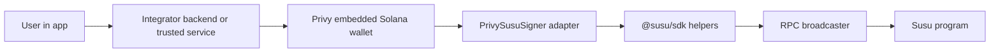

# Privy Integration Guide

## TL;DR

- Use the runnable [Privy example](../examples/with-privy/) as the source of truth for wiring Privy embedded Solana wallets into Susu.
- A Susu group is a ROSCA: members contribute on a schedule, and one member receives each rotation payout.
- The example creates three Privy Solana wallets, adapts each wallet to the `@solana/kit` `TransactionSigner` shape, then calls `createGroup`, `acceptInvite`, `postCollateral`, and `contribute`.
- Keep Privy credentials on the server side, keep `CLUSTER=devnet` while testing, and replace the demo RPC shim with a real broadcaster before mainnet.

## Architecture



The adapter boundary matters. Privy owns wallet creation and signing; Susu only needs a signer address and a way to sign and send the helper payload. A PDA is a program-derived address, which Susu uses for protocol-owned accounts that no private key controls.

## Walkthrough

Start from a clean clone and run the example exactly where its dependencies live:

```sh
pnpm install
cd examples/with-privy
pnpm install
cp .env.example .env
```

Fill `.env` with `PRIVY_APP_ID`, `PRIVY_APP_SECRET`, `HELIUS_RPC_URL`, and `CLUSTER=devnet`. The walkthrough mirrors `src/index.ts`:

1. `runPrivySusuDemo` reads the cluster and creates a `PrivyClient`.
2. `privy.wallets().create({ chain_type: 'solana' })` creates three member wallets.
3. `createPrivySusuSigner` wraps each Privy wallet as a `TransactionSigner`.
4. `createSusuClient({ cluster, rpc }).use(signer(member.signer))` builds a Susu client for each member.
5. The creator calls `createGroup`.
6. Each member calls `acceptInvite`, `postCollateral`, and `contribute`.

Copy-paste smoke check from `examples/with-privy`:

```sh
cat > story-6-9-privy-walkthrough.ts <<'TS'
import { runPrivySusuDemo } from './src/index.js';

const result = await runPrivySusuDemo();
console.log(`Privy members: ${result.members.length}`);
console.log(`Susu helper signatures: ${result.signatures.length}`);
TS

pnpm exec tsx story-6-9-privy-walkthrough.ts
rm story-6-9-privy-walkthrough.ts
```

For local verification without editing the walkthrough, run:

```sh
pnpm start
pnpm test
```

The example uses a demo RPC shim that simulates successfully and delegates signing to the Privy signer. Production integrations should compile and broadcast real Solana transactions behind the same `SusuRpc` interface.

## Trade-offs

Privy reduces wallet setup friction because users do not need to bring a browser wallet or seed phrase. The trade-off is custodianship and operations: your app must secure Privy credentials, define account recovery, and decide which server-side actions are allowed to request signatures.

Recovery is a product requirement, not only an SDK setting. Document who can recover an embedded wallet, how a user proves identity, and how recovery interacts with active Susu positions.

Mainnet needs stricter review than the demo path. Keep human-readable transaction review, rate-limit signing, fund fee payers, and monitor failed broadcasts before inviting real depositors.

The main alternative is wallet-standard direct connect. That keeps custody with the user wallet and can reduce backend signing risk, but it increases onboarding friction and makes recovery depend on the user's wallet provider.

## Pinned versions

Source: [`../examples/with-privy/package.json`](../examples/with-privy/package.json). Keep these strings in lockstep with the example.

| Package | Version |
| --- | --- |
| `@privy-io/node` | `0.18.0` |
| `@solana/kit` | `^5.0.0` |
| `@solana/web3-compat` | `^0.0.21` |
| `@susu/sdk` | `workspace:*` |
| `bs58` | `6.0.0` |
| `dotenv` | `^17.4.2` |
| `@types/node` | `^20.19.40` |
| `tsx` | `^4.21.0` |
| `typescript` | `5.9.3` |
| `vitest` | `^4.1.5` |

## See also

- [Runnable Privy example](../examples/with-privy/)
- [Privy documentation](https://docs.privy.io/)
- [Susu TypeScript SDK](./sdk-typescript.md)
