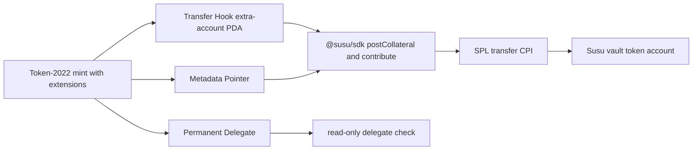

# Token-2022 Extensions Integration Guide

## TL;DR

- Use the runnable [Token-2022 extensions example](../examples/with-token-extensions/) as the source of truth for Susu groups that use a Token-2022 mint.
- The example enables Transfer Hook, Metadata Pointer, and Permanent Delegate on the mint plan, then passes the Token-2022 program into Susu helper calls.
- Transfer Hook requires extra accounts on every transfer path, including `postCollateral` and `contribute`.
- Confidential transfer work is a future confidential-extension roadmap item; it is not part of the v0.1.0 Susu support boundary.

## Architecture



Token-2022 keeps the mint and token program explicit. Susu does not need to store extension state, but the transaction builder must pass the token program and any extension-required accounts. A CPI is a cross-program invocation, where the Susu program calls the token program during a Susu instruction.

## Walkthrough

Start from a clean clone:

```sh
pnpm install
cd examples/with-token-extensions
pnpm install
cp .env.example .env
```

`HELIUS_RPC_URL` is optional for the logging demo. The walkthrough mirrors `src/index.ts` and `src/mintSetup.ts`:

1. `runToken2022SusuDemo` creates a payer, permanent delegate, and three demo members.
2. `buildToken2022MintPlan` calls `extension('TransferHook')`, `extension('MetadataPointer')`, and `extension('PermanentDelegate')`.
3. The mint plan derives the Transfer Hook extra-account PDA with `getProgramDerivedAddress`.
4. `sendToken2022MintPlan` logs the mint initialization instructions.
5. `mintMockMemberSupply` logs mock member supply minting.
6. `createSusuClient` uses `solanaDevnetRpc` with a logging RPC shim.
7. `createGroup` passes `mint: mintPlan.mint` and `tokenProgram: TOKEN_2022_PROGRAM_ADDRESS`.
8. For each member, `token2022TransferAccounts` adds hook accounts to `postCollateral` and `contribute`.
9. `permanentDelegateMatches` verifies the configured Permanent Delegate in read-only form.

Copy-paste smoke check from `examples/with-token-extensions`:

```sh
cat > story-6-9-token-extensions-walkthrough.ts <<'TS'
import { runToken2022SusuDemo } from './src/index.js';

const summary = await runToken2022SusuDemo();
console.log(`Token-2022 mint: ${summary.mintPlan.mint}`);
console.log(`Extensions: ${summary.mintPlan.extensions.map((item) => item.__kind).join(', ')}`);
console.log(`Permanent Delegate check: ${summary.permanentDelegateOk ? 'ok' : 'failed'}`);
TS

pnpm exec tsx story-6-9-token-extensions-walkthrough.ts
rm story-6-9-token-extensions-walkthrough.ts
```

For local verification:

```sh
pnpm start
pnpm test
PNPM_TEST_E2E=1 pnpm test:e2e
```

## Trade-offs

Transfer Hook: every transfer must include the hook program's extra accounts. Missing or stale hook accounts will break `postCollateral` and `contribute`, so keep account derivation close to transaction construction.

TransferFee math: if your fork adds a TransferFee extension, gross-up contribution and collateral amounts before sending. Susu v0.1.0 examples do not implement fee gross-up, so do not assume the received vault amount equals the sent amount when fees are enabled.

Metadata Pointer: pointing metadata at the mint simplifies discovery for wallets and indexers, but metadata authority and update policy still need product review.

Permanent Delegate: the delegate can force-transfer token accounts for the mint. Surface that authority in user-facing review before users deposit funds.

Confidential-extension roadmap: confidential transfer and confidential reputation are future work. They depend on Solana ZK ElGamal availability and are not promised by this v0.1.0 integration path.

## Pinned versions

Source: [`../examples/with-token-extensions/package.json`](../examples/with-token-extensions/package.json). Keep these strings in lockstep with the example.

| Package | Version |
| --- | --- |
| `@solana-program/token-2022` | `^0.7.0` |
| `@solana/kit` | `^5.0.0` |
| `@solana/web3-compat` | `^0.0.21` |
| `@susu/sdk` | `workspace:*` |
| `@types/node` | `^25.0.0` |
| `tsx` | `^4.21.0` |
| `typescript` | `5.9.3` |
| `vitest` | `^4.1.5` |

## See also

- [Runnable Token-2022 extensions example](../examples/with-token-extensions/)
- [Solana Token Extensions documentation](https://solana.com/docs/tokens/extensions)
- [Susu TypeScript SDK](./sdk-typescript.md)
