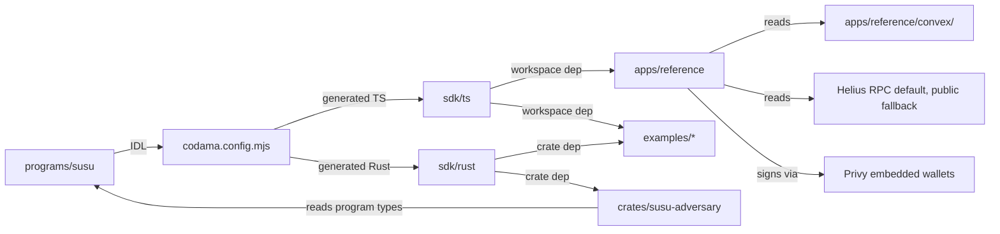

# Architecture Decision Document — Susu Protocol

_This document builds collaboratively through step-by-step discovery. Sections are appended as we work through each architectural decision together._

## Project Context Analysis

### Requirements Overview

**Functional Requirements (58 total in PRD):**

The FR surface decomposes into eight clusters that map directly to architectural components:

| FR cluster | Range | Architectural locus |
|---|---|---|
| Group Lifecycle Management | FR1–FR7 | On-chain Anchor program (`Group`, `MemberPosition` accounts, invite mechanism) |
| Contributions & Collateral | FR8–FR14 | Anchor program (curve enforcement, vault PDAs, slashing logic) |
| Rotations & Permissionless Payouts | FR15–FR20 | Anchor program (deterministic rotation, claim instruction, no scheduler dependency) |
| Curve Verification & Audit Artifacts | FR21–FR27 | `tests/invariants/`, `crates/susu-adversary/`, `docs/` (formal write-ups), `audits/` |
| IDL Freeze & Immutability | FR28–FR30 | CI workflow, `IDL_FREEZE.md`, deploy script |
| Developer Integration Surface | FR31–FR38 | `sdk/ts` (`@susu/sdk`), `sdk/rust` (`susu-client`), `examples/with-{squads,privy,token-extensions}`, parity-check CI |
| Reference App UX | FR39–FR47 | `apps/reference` (Next.js 15 App Router) |
| Community Contribution / Submission / Reproducibility | FR48–FR58 | `apps/reference/i18n`, `README.md`, `/log`, `/.github/workflows/` |

**Non-Functional Requirements (40+ across 8 categories):**

- **Performance:** ≤200K CU per instruction (NFR-P1); `pnpm susu:demo` ≤60s on devnet (NFR-P2); `pnpm verify` ≤10min on a clean clone (NFR-P6); proptest ≤180s (NFR-P4); adversary sim ≤10min (NFR-P5)
- **Security:** Audit-gated mainnet (NFR-S1); Anchor checked-math discipline (NFR-S2); `cargo deny`/`cargo audit` on every CI run (NFR-S3); verifiable Docker build (NFR-S4); upgrade authority burned post-audit (NFR-S5); Wallet-Standard-only signing (NFR-S6); `simulateTransaction` before every signature (NFR-S7); explicit `cluster: 'mainnet-beta'` (NFR-S8); untrusted-data discipline (NFR-S9)
- **Reliability:** Helius RPC fallback to public (NFR-R1); Privy fallback to extension wallets (NFR-R2); Sphere optional (NFR-R3); cluster status surfaced (NFR-R4); daily `/log` unbroken (NFR-R5)
- **Accessibility & i18n:** locale-key parity in CI (NFR-A1); en + vi live, ar/es/yo/ht-kreyol stubs (NFR-A2); RTL-ready (NFR-A3); 360px mobile floor (NFR-A4); WCAG 2.1 AA target (NFR-A5); zero-crypto-knowledge onboarding (NFR-A6)
- **Integration:** USDC + USDT (NFR-I1); Squads/Privy/Token Extensions/Helius/Sphere composability (NFR-I2–I6); `@solana/web3-compat` only at boundaries (NFR-I7)
- **Reproducibility:** byte-deterministic adversary artifact via `--seed $COMMIT_SHA` (NFR-Re1); deterministic IDL build (NFR-Re2); Docker-reproducible binary (NFR-Re3); `pnpm verify` one-command (NFR-Re4)
- **Observability:** daily engineering log; CI badge in README; deployment status in README
- **Compliance:** non-custodial / non-fee / non-yield posture preserved (NFR-C1); legal opinion published (NFR-C2); no token / no governance (NFR-C3); PII minimized (NFR-C4)

### Scale & Complexity

- **Primary technical domain:** hybrid `blockchain_web3` (Solana Anchor program is the canonical artifact) + `developer_tool` (TS SDK, Rust crate, reference app, runnable examples, formal docs).
- **Complexity level:** **High** — multi-language monorepo (Rust + TypeScript), regulated-adjacent (FinCEN posture must hold), audit-gated, immutability-committed, multi-stakeholder UX (developer + judge + auditor + end-saver + translator), 4-week submission window with hard external dependencies.
- **Estimated architectural components:**
  - 1 on-chain Anchor program (`programs/susu`)
  - 2 client libraries (TS `@susu/sdk`, Rust `susu-client`)
  - 1 reference Next.js 15 application (dual-skin, multi-locale)
  - 3 composability example apps (`with-squads`, `with-privy`, `with-token-extensions`)
  - 1 adversarial simulator binary (`crates/susu-adversary`)
  - 5 formal documentation artifacts (curve write-up, threat model, FinCEN framing, legal opinion, composability diagram)
  - 1 verifiable-build Docker pipeline
  - 1 daily engineering log (`/log/YYYY-MM-DD.md`)

### Technical Constraints & Dependencies

**Hard locks (carried forward from PRD/UX as non-negotiable):**

- Solana mainnet + Anchor 1.0; devnet for submission window, mainnet post-audit
- USDC + USDT (SPL Token); Token-2022 on the v2 roadmap only
- Permissionless payout claim — no keeper / scheduled-execution dependency anywhere
- IDL frozen on T+0 with SHA-256 in `IDL_FREEZE.md`; re-freeze requires public log entry
- Upgrade authority burned post-audit (mainnet)
- Stack discipline: `@solana/kit` primary; `@solana/web3-compat` only at integration boundaries; framework-kit + `@solana/react-hooks` for Wallet-Standard discovery
- Reference app stack already locked: Next.js 15 App Router, Convex (group metadata only — no PII at protocol layer), Privy, Helius, shadcn/ui + Tailwind, `[data-skin]` runtime swap with cross-skin `--signal` mint identity tokens
- Visual direction locked: Phantom-fintech dark, Solana mint-green primary (NOT purple), Solana cyan secondary, kente copper / terracotta for diaspora skin
- Typography locked: Geist + Inter + Geist Mono, self-hosted via `next/font`
- License: MIT, public from commit zero
- Solo entrant; 4-week window; external dependencies (audit firm, law firm, community translators) all engaged Day 1

**External integrations (compliance posture inherited per PRD):**

| Integration | Surface | Inherited posture |
|---|---|---|
| USDC SPL | Protocol vault | Circle's NY DFS + MTL coverage |
| USDT SPL | Protocol vault | Tether's posture |
| Squads | `examples/with-squads` + reference app | Squads multisig audit |
| Privy | `examples/with-privy` + reference app | Non-custodial wallet provider posture |
| Token Extensions | `examples/with-token-extensions` | Solana Foundation Token-2022 |
| Helius | SDK default RPC + reference app | Helius RPC infrastructure |
| Sphere | Optional fork-toggleable on-ramp/off-ramp | Sphere KYC + licensing |
| Convex | Reference-app metadata only (display names, invite metadata) | GDPR Article 17 erasure |

### Cross-Cutting Concerns Identified

1. **IDL as the single source of truth.** Anchor IDL drives Codama codegen → TS + Rust SDKs. CI must re-derive both clients on every PR and assert public-API parity. Drift is caught structurally, not by review.
2. **Reproducibility chain.** `pnpm verify` orchestrates `anchor test` (LiteSVM/Mollusk) + Rust property test + adversary sim + IDL hash check + immutability check + 60s demo on a Surfpool fork. Every claim in the README has a one-command verifier.
3. **Cluster discipline.** SDK + reference app must surface `devnet` vs `mainnet-beta` everywhere. SDK refuses implicit mainnet sends. Cluster pill is a UX invariant on every screen.
4. **Wallet-Standard-only signing.** No code reads / stores / transmits seed phrases or keypair files anywhere in the tree. **Wallet-Standard is the primary discovery surface** (via `framework-kit`'s discovery layer); Privy is a Wallet-Standard provider that delivers the embedded-wallet (email-based, zero seed-phrase) onboarding UX in the reference app, alongside Phantom, Backpack, and Solflare. SDK and reference-app code never special-case Privy. `@solana/web3-compat` is the only adapter point where any legacy `web3.js` types may surface.
5. **Theming via `[data-skin]` attribute.** Tailwind colors map to CSS custom properties; runtime swap toggles `<html data-skin="…">`. Cross-skin identity tokens (`--signal` mint, `--bg`, `--warn`, `--danger`) must NOT swap — protocol identity is structural, not cosmetic.
6. **i18n key parity invariant.** Every locale bundle must have all keys present in `en.json` baseline. CI fails the build on missing keys — this is a structural guarantee that `CONTRIBUTING-TRANSLATIONS.md` PRs cannot ship broken.
7. **Property + adversary as marketing artifacts.** `tests/invariants/no_strategic_default.rs` (≥10K proptest cases) and `crates/susu-adversary` (10K-case sim, byte-reproducible from `--seed $COMMIT_SHA`) are not just CI checks — they are public, executable proofs of the central novelty claim. Every README claim about strategic default points to one of these by file path.
8. **Immutability gate as live signal.** Post-mainnet, `<UpgradeBurnedBadge />` is rendered server-side from `solana program show $PROGRAM_ID --url mainnet-beta` returning the System Program incinerator address. The badge IS the assertion.
9. **Daily engineering log as narrative spine.** `/log/YYYY-MM-DD.md` from T+0 to submission close; light-touch notes, not essays. **Updated 2026-05-06:** because BAD will execute most commits autonomously over the 4-week window, the daily log is enforced by BAD's PR step (Step 6): every PR that lands on main appends or updates `/log/YYYY-MM-DD.md` with a one-line entry summarizing the merged work. CI lint asserts a log entry exists for every date with at least one merged PR.
10. **Compliance as schema, not policy.** The non-custodial / non-fee / non-yield posture is enforceable via CI assertion: no protocol-owned token accounts; no fee paths in instruction handlers; no yield-routing CPIs. The legal posture has structural backing, not just narrative.

## Starter Template Evaluation

### Primary Technology Domain

**Hybrid:** Solana Anchor program (`blockchain_web3`) + multi-package TypeScript monorepo (`developer_tool` + `web_application`). No single off-the-shelf starter covers both halves cleanly.

### Starter Options Considered

| Option | Fit | Verdict |
|---|---|---|
| **`anchor init` only** | Covers `programs/susu/` cleanly. Generates IDL + Rust + minimal TS test harness. Does NOT scaffold a monorepo, an SDK, a Next.js app, or examples. | **Adopt for the Anchor program subtree only.** |
| **`create-next-app@latest`** | Covers `apps/reference/` cleanly. Next.js 15 App Router + TS + Tailwind + ESLint. Does NOT understand the monorepo, the SDK, or the on-chain side. | **Adopt for the reference-app subtree only.** |
| **`create-solana-dapp` (Solana Foundation)** | Solana's official "fullstack Solana dApp" generator — pairs Anchor + Next.js + wallet adapter in one repo. Closest single-shot match to Susu's shape. | **Rejected.** Templates are wallet-adapter-driven (legacy `@solana/web3.js`), not `@solana/kit`-first. Stack discipline (kit-first, web3-compat at boundaries only) is a hard project lock from PRD §"Wallet Support & Signing UX" and from project memory. Adopting `create-solana-dapp` would force us to fight the template instead of using it. |
| **Turborepo `with-*` examples** (e.g., `with-tailwind`) | Good monorepo skeleton, but none ship Anchor, an SDK package convention, or `pnpm susu:demo`-style orchestration. | **Rejected.** Adds Turborepo cache complexity for minimal incremental value over a plain `pnpm` workspace at our scale (3 apps + 2 SDKs + 1 simulator + examples). Re-evaluate at v0.2 if build times become a bottleneck. |
| **T3 / RedwoodJS / Blitz** | Web2-fullstack opinionated starters. Don't speak Solana. | **Rejected — irrelevant.** |
| **Custom monorepo scaffold** | Compose `pnpm` workspaces + `anchor init` (for `programs/susu`) + `create-next-app` (for `apps/reference`) + hand-rolled SDK packages (`sdk/ts`, `sdk/rust`) + Codama codegen for parity. | **Selected.** |

### Selected Starter: **Custom pnpm-workspace monorepo scaffolded from `anchor init` + `create-next-app`**

**Rationale for Selection:**

1. **No single starter covers Susu's hybrid shape.** Reference-app-only or program-only starters force a fight with the template; `create-solana-dapp` violates the kit-first stack lock. The honest move is to compose the two best-in-class single-purpose starters under a `pnpm` workspace.
2. **Stack discipline is non-negotiable.** PRD §"Wallet Support & Signing UX" + project memory both lock `@solana/kit` as primary and `@solana/web3-compat` as the only legacy boundary. A template that hardcodes `@solana/web3.js` v1 patterns would inject technical debt on Day 1.
3. **Monorepo at this scale = `pnpm` workspaces alone.** Three apps + two SDKs + one simulator + three examples is well below the threshold where Turborepo's caching pays off. `pnpm` workspaces give us `workspace:*` linking, parallel `pnpm -r run <script>` execution, and zero added abstraction. We can adopt Turborepo at v0.2 if `pnpm verify` cold-runs become slow.
4. **`anchor init` ships exactly what we need for the program subtree.** Anchor 1.0 with Surfpool + LiteSVM as defaults — already the testing posture we want per PRD.
5. **`create-next-app@latest` ships React 19 + Next.js 15 + Tailwind + TS** — already the reference-app stack locked in PRD/UX.
6. **Codama is the canonical IDL → client codegen tool in 2026** — generates both TS and Rust clients from a single Anchor IDL, which is exactly the FR33 parity-check requirement.
7. **Familiar to forking developers (Aisha).** Anchor + Next.js + pnpm + shadcn is the ambient 2026 Solana-app pattern; forks don't have to learn a new system.

### Initialization Commands

These run at T+0 to scaffold the monorepo. The full sequence is itself the **first implementation story**.

```bash
# 1. Create the monorepo root
mkdir susu-monorepo && cd susu-monorepo
pnpm init
# Configure pnpm-workspace.yaml with: apps/*, sdk/ts, examples/*, crates/* are Rust workspace members (handled separately)

# 2. Anchor program subtree
anchor init programs/susu --no-git
# Anchor 1.0+ (verified via web search 2026-05-05)
# Adjusts: Surfpool + LiteSVM defaults, no Solana CLI dependency, declare_program! parser

# 3. Reference app subtree
pnpm dlx create-next-app@latest apps/reference \
  --ts --app --tailwind --eslint --import-alias "@/*" --no-src-dir --use-pnpm
# Next.js 15 stable, React 19, Turbopack dev, App Router

# 4. SDK packages (hand-rolled — no template; Codama generates client modules)
mkdir -p sdk/ts && cd sdk/ts && pnpm init
# Configure package.json: name="@susu/sdk", peerDependencies: "@solana/kit", "@solana/web3-compat"
cd -

# 5. Codama codegen wiring (generates TS + Rust clients from frozen IDL)
pnpm add -D codama @codama/renderers-js @codama/renderers-rust -w
# Configured via codama.config.mjs at repo root

# 6. Rust workspace for adversary simulator + Rust SDK
# Cargo.toml at repo root with workspace members: ["programs/susu", "sdk/rust", "crates/susu-adversary"]

# 7. Composability examples (each is its own pnpm workspace member)
mkdir -p examples/with-{squads,privy,token-extensions}
# Each scaffolded as a minimal Next.js or Node CLI app, ~200 LOC, own README

# 8. Doc + log + audit + test scaffolding
mkdir -p docs audits/adversary log tests/invariants .github/workflows
touch IDL_FREEZE.md CONTRIBUTING.md CONTRIBUTING-TRANSLATIONS.md README.md LICENSE
```

### Architectural Decisions Provided by Starter

**Language & Runtime:**
- TypeScript 5.x (strict mode) for SDK + reference app + examples
- Rust (toolchain pinned via `rust-toolchain.toml`) for Anchor program + Rust SDK + adversary sim
- Node 20 LTS for tooling (pinned in `.nvmrc` + `package.json` engines field)
- pnpm 9.x for package management

**Styling Solution:**
- Tailwind CSS 4.x via `create-next-app --tailwind` flag
- shadcn/ui copied directly into `apps/reference/components/ui/` per shadcn convention (no npm dependency)
- CSS custom properties on `[data-skin]` attribute for runtime palette swap
- `next/font` for self-hosted Geist + Inter + Geist Mono (no external Google Fonts request)

**Build Tooling:**
- Anchor build pipeline for `programs/susu` (Anchor 1.0 verifiable-build via Docker)
- Next.js 15 + Turbopack (dev) / webpack (build) for `apps/reference` and examples
- `tsc` for SDK build; `tsup` or pure `tsc` per-package (decision deferred to per-package level)
- `cargo build --workspace` for Rust workspace
- pnpm scripts orchestrate cross-package build via `pnpm -r run <script>`

**Testing Framework:**
- Anchor test suite (LiteSVM + Mollusk fixtures) for protocol unit tests
- `proptest` crate for property tests (`tests/invariants/no_strategic_default.rs`)
- Surfpool for realistic devnet/mainnet-fork integration tests
- Vitest for SDK + reference-app unit tests (lighter, faster than Jest, native ESM, TS-first)
- Playwright for reference-app E2E + visual regression at all breakpoints
- `@axe-core/playwright` for accessibility regression in CI

**Code Organization:**
- pnpm workspace at repo root: `apps/*`, `sdk/ts`, `examples/*`
- Rust workspace at repo root: `programs/susu`, `sdk/rust`, `crates/*`
- One package per concern, no monolithic packages
- `workspace:*` protocol for inter-package linking

**Development Experience:**
- `pnpm dev` runs the reference app against Surfpool fork
- `pnpm susu:demo` runs the full ROSCA demo cycle in ≤60s on devnet (FR37, NFR-P2)
- `pnpm verify` runs the full reproducibility chain in ≤10min (NFR-Re4)
- `anchor test` runs LiteSVM + Mollusk + property test
- Hot reload via Turbopack in `apps/reference`; `cargo watch` for Rust during development
- VS Code workspace recommendations + `rust-analyzer` + `tailwindcss` extensions

**Note:** Project initialization using the commands above is the **first implementation story**. The output of this story is a runnable empty monorepo against which Day 2 can begin Anchor program development.

## Core Architectural Decisions

> Section refined via party-mode roundtable with Winston (architect), Murat (test architect), Mary (analyst), Amelia (dev). Their structural commitments are integrated below.

### Decision Priority Analysis

**Critical Decisions (Block Implementation):**

1. Anchor program version (1.0.x), Solana toolchain pinning, IDL-as-parity-source
2. Codama as the IDL → TS + Rust client codegen tool
3. `@solana/kit` as the primary client; `@solana/web3-compat` only at integration boundaries
4. PDA seed constants and error code enum as the canonical surfaces
5. Permissionless payout claim model (no scheduler / keeper)
6. SPL Token vs Token-2022 split: SPL Token v0.1.0; Token-2022 only in `examples/with-token-extensions`
7. Local test stack: LiteSVM (`anchor test` ≤180s feedback loop) + Surfpool (integration / `pnpm susu:demo`)

**Important Decisions (Shape Architecture):**

8. Reference app stack: Next.js 15 App Router + React 19 + Tailwind 4 + shadcn/ui (CLI-installed into repo) + `next/font` for self-hosted Geist/Inter/Geist Mono
9. i18n library: `next-intl` (App Router-native, ICU MessageFormat, RTL-friendly)
10. Convex scoping: group metadata only; structural import-isolation enforced in CI
11. Privy integration: `@privy-io/react-auth/solana` for embedded wallets + Wallet-Standard discovery for browser-extension fallback
12. Helius RPC default with public-RPC fallback; `priorityFee` parameter on every SDK transaction-builder helper
13. Hosting: Vercel for `apps/reference`; GitHub for monorepo; npm + crates.io for SDK packages
14. CI: GitHub Actions; verifiable Docker build via `solana-verify` + Anchor `verifiable-build`
15. Compliance enforcement: static-analysis CI script (`scripts/check-fincen-posture.sh`) asserting no protocol-owned non-PDA token accounts and no fee/yield CPIs
16. Test framework split: Vitest for TS unit; Playwright + `@axe-core/playwright` for reference-app E2E + a11y; `proptest` for Rust property; bespoke Rust binary for adversary sim

**Deferred Decisions (Post-MVP, v0.2+):**

- Turborepo adoption — reconsider if `pnpm verify` cold-runs exceed 10min consistently
- `npx create-susu-app` scaffolder — Phase 2 (Growth) per PRD
- Confidential reputation overlay (Token-2022 ZK extension) — v2 Vision
- Multi-stablecoin (PayPal USD, EURC) — v2 Vision
- Cross-chain bridge — only on demonstrated demand

### Data Architecture

**On-chain account model (Anchor program):**

| Account | PDA seeds | Owner | Purpose |
|---|---|---|---|
| `Group` | `[GROUP_SEED, group_id]` | Susu program | Group config: members[], rotation schedule, mint, contribution amount, curve params, status |
| `MemberPosition` | `[MEMBER_SEED, group_pda, member_pubkey]` | Susu program | Per-(group, member) state: rotation slot, contribution history, collateral posted, slash status |
| `Vault` token account | `[VAULT_SEED, group_pda]` | SPL Token program (authority = group PDA) | Escrow for contributions + collateral; SPL Token (USDC or USDT mint) |
| `RotationReceipt` | `[ROTATION_SEED, group_pda, rotation_index_le_bytes]` | Susu program | Permanent record of each rotation's payout (amount, recipient, timestamp, signature) |

**PDA seed constants — single source of truth:**

```rust
// programs/susu/src/seeds.rs
pub const GROUP_SEED: &[u8] = b"group";
pub const MEMBER_SEED: &[u8] = b"member";
pub const VAULT_SEED: &[u8] = b"vault";
pub const ROTATION_SEED: &[u8] = b"rotation";
```

**Per Amelia's lock:** TS SDK + Rust SDK derive PDAs by importing/mirroring this constants module. No string literal seeds anywhere else in the codebase. Drift between client-side and on-chain PDA derivation is structurally impossible.

**Off-chain metadata (Convex — reference app only):**

| Table | Purpose | PII? |
|---|---|---|
| `groupMetadata` | display name, description, invite-link metadata, locale preference | Low (display name optional) |
| `inviteLinks` | invite token → group PDA mapping, expiry | None |
| `memberDisplayNames` | wallet pubkey → display name mapping (optional) | Yes (display name; GDPR Article 17 erasable) |

**Convex isolation invariant** (per Winston): Convex imports are confined to `apps/reference/lib/convex/`. CI asserts no file outside that directory imports from `convex` or `@convex-dev/*`. The on-chain protocol is 100% functional with Convex absent.

**Data validation strategy:**
- On-chain: every account deserialization validates `owner`, length, and discriminator (NFR-S9). Memo / string fields treated as adversarial input.
- Off-chain (Convex): Zod schema validation at the API boundary; reject + 400 on schema violation.
- SDK: TypeScript types from Codama codegen; runtime validation via `@solana/kit` codecs.

**Migration approach:** None for v0.1.0 (greenfield). v0.2.0+ migrations follow Anchor 1.0's `Migration<From, To>` account schema upgrade pattern *only on devnet*. **Mainnet is immutable post-audit — bug fixes require `susu-v2` redeploy at new program ID + social migration**, per PRD FR30 + PRD §"Innovation Risk Mitigation."

**Caching strategy:**
- SDK: no caching (every read returns fresh on-chain state); integrators may cache with their own TTL discipline
- Reference app: Convex's built-in reactive cache for metadata; no caching of on-chain state — always re-fetch via Helius RPC
- README badges: server-rendered at build time + revalidated on push (live-CI signal posture)

### Authentication & Security

**Authentication method:**
- Reference app: **Wallet-Standard is the primary discovery surface** (via `framework-kit` / `@solana/react-hooks` discovery layer). Privy registers as one Wallet-Standard provider alongside Phantom, Backpack, and Solflare; Privy's value-add is the embedded-wallet UX (email-based, zero seed-phrase) for non-crypto users. The reference app's onboarding routes prefer Privy when configured, but the SDK and reference-app code never special-case Privy — every signer flows through the same Wallet-Standard interface.
- SDK: `@solana/kit` `Signer` abstraction; integrators provide their own signer (Wallet-Standard-discovered or otherwise).
- Token Extensions / confidential transfer note: *Confidential reputation depends on the ZK ElGamal program's re-enablement (currently in security audit on mainnet/devnet); v2 timing is gated on Solana Foundation re-enable. The `examples/with-token-extensions` story is scoped to Transfer Hook + Metadata Pointer + Permanent Delegate (mainnet-live as of May 2026); confidential transfer is post-v2.*

**Authorization patterns:**
- On-chain: Anchor `#[account(...)]` constraints enforce signer + writability + ownership; PDA derivation enforces who can sign for what
- Reference app: route protection via Privy's `useAuthenticated` hook; protected routes redirect to `/login`
- SDK: refuses implicit mainnet sends — `cluster: 'mainnet-beta'` must be passed explicitly (NFR-S8)

**Security middleware / disciplines:**

- **Wallet-Standard-only signing.** No code in the tree reads/stores/transmits seed phrases, mnemonics, or keypair files. CI grep asserts this. (NFR-S6)
- **Transaction simulation before signing.** SDK helpers expose `simulate: boolean` (default `true`). Per Amelia's lock: simulation logic lives in the **SDK**, not the UI. SDK throws a typed `SusuSimulationError` if simulation reports failure; UI just renders. (FR34, NFR-S7)
- **Cluster discipline.** SDK refuses to send mainnet transactions unless `cluster: 'mainnet-beta'` is explicitly passed. Reference app surfaces active cluster via always-visible `<ClusterPill />` (FR47, NFR-S8).
- **Untrusted on-chain data.** Every account deserialization validates owner, length, discriminator. Memo/string fields treated as adversarial input — never used in formatting, logging, or downstream calls. (NFR-S9)
- **No unsafe arithmetic.** `cargo-deny` ruleset blocks `saturating_*` math in `programs/susu/src/curve.rs`. Checked math everywhere via `checked_add`, `checked_mul`, etc.
- **Compliance posture as static analysis.** `scripts/check-fincen-posture.sh` asserts:
  1. No `init` of token accounts whose authority is anything other than a deterministic group PDA
  2. No fee paths in instruction handlers (no transfers to non-vault, non-recipient addresses)
  3. No CPIs to known yield-routing programs (allowlist approach: only SPL Token program is on the allowlist for token CPIs)
  Fails CI on violation. (NFR-C1)

**Audit gating:**
- Pre-audit hardening: `cargo deny`, `cargo audit`, `cargo clippy --all-targets`, Anchor `verifiable-build`, all dependencies pinned exact in `Cargo.lock` + `pnpm-lock.yaml` (NFR-S3, NFR-S4)
- Mainnet deploy gated on zero Critical / zero High findings (NFR-S1)
- Audit firm engaged Day 1; report linked from README; cites `tests/invariants/no_strategic_default.rs` and `audits/adversary/adversary-report.json` by file path

**Immutability gate (post-audit, mainnet only):**
- `solana program deploy --upgrade-authority <incinerator>` then `solana program show $PROGRAM_ID --url mainnet-beta` returns `1nc1nerator11111111111111111111111111111111`
- IDL hash frozen in tagged release; CI asserts on every main commit
- `<UpgradeBurnedBadge />` server-rendered from this live signal

### API & Communication Patterns

**On-chain instruction surface (Codama-generated; canonical):**

```
create_group, accept_invite, post_collateral, contribute,
claim_payout, top_up_collateral, withdraw_collateral,
slash_member, cancel_group, query_history (via account fetches, not an instruction)
```

Per Winston: **the Codama-generated layer is the parity surface.** TS idiomatic helpers (e.g., `await contribute(client, {...})`) and Rust idiomatic helpers (a thin newtype layer on top of generated code) are *sugar*, not parity surface. CI parity check asserts on the generated layer — instruction names, account structs, error codes — not on sugar.

**SDK API design:**
- TypeScript: fluent client pattern from `@solana/kit` — `createSusuClient().use(signer(...)).use(solanaDevnetRpc({...}))`
- Rust: builder pattern matching idiomatic `solana-sdk` style; same instruction names; same error enum
- Both: explicit cluster, explicit signer, explicit priority fee parameter

**SDK error handling:**
- Generated `SusuError` enum from Anchor IDL → exported by both TS + Rust SDKs (per Amelia's lock)
- TS: `SusuError`, `SusuSimulationError`, `SusuRpcError` discriminated union; never throw bare `Error`
- Rust: `thiserror::Error`-derived `Error` enum with structured variants
- Reference app surfaces error codes via i18n keys (`errors.InsufficientCollateral`, etc.); locale parity (NFR-A1) covers them

**API documentation:**
- TS: TypeDoc-generated reference at `docs/sdk-typescript.md` + inline JSDoc on all public exports
- Rust: `cargo doc --no-deps` output committed to `docs/sdk-rust/` for offline browsing (regenerated per release)
- Both: every public helper carries a worked example; every error code has a recovery hint

**Rate limiting:**
- Protocol layer: NONE. Adding rate-limiting at the program would compromise permissionlessness. Per PRD §"Innovation Risk Mitigation."
- RPC layer (Helius): integrator's responsibility; SDK exposes Helius's recommended priority fee algorithm via `getPriorityFeeEstimate` helper (NFR-P-derived)
- Reference app: standard Vercel rate-limiting on Convex API routes; not on RPC calls

**Communication between services:**
- Protocol ↔ SDK: Anchor IDL + Codama codegen (single source of truth)
- SDK ↔ Reference app: typed imports from `@susu/sdk` (workspace dependency)
- Reference app ↔ Convex: Convex's typed React hooks (`useQuery`, `useMutation`)
- Reference app ↔ Privy: `@privy-io/react-auth` hooks
- Reference app ↔ Helius: SDK passes through; reference app never calls Helius directly

### Frontend Architecture

**State management:**
- React Server Components by default (Next.js 15 App Router)
- Client components: minimal local state via `useState` + `useReducer`
- Cross-component shared state: **Zustand** (selected — small bundle, framework-agnostic, plays well with RSC boundary). Used for: skin selection (persisted to localStorage), locale selection (persisted), wallet/cluster state (synced from Privy + SDK)
- Server state: Convex's reactive hooks (`useQuery`) — no separate query library needed
- On-chain state: SDK fetch calls; React Query NOT introduced (avoid double-cache; Convex handles its layer; on-chain state always fresh)

**Component architecture:**
- shadcn/ui primitives in `apps/reference/components/ui/` (copied into repo)
- Susu-specific components in `apps/reference/components/susu/` (per UX spec §"Custom Components"): `<CurveVisualizer />`, `<TransactionConfirmModal />`, `<SkinToggle />`, `<RotationCard />`, `<ClusterPill />`, `<AdversaryBadge />`, `<UpgradeBurnedBadge />`, `<CodeBlock />`, `<MemberAvatar />`
- Skin-specific glyphs in `apps/reference/components/skins/` (icons, illustrations only — no semantic structure)
- Server vs Client component split: badges, README hero, docs are RSC; everything that needs `<wallet>`, `<simulator>`, or interactivity is `'use client'` at the leaf

**Routing strategy:**
- Next.js 15 App Router file-based routing
- Locale routing via `next-intl` middleware: `/[locale]/...` (en, vi, ar, es, yo, ht-kreyol)
- Group routes: `/[locale]/g/[groupId]` for individual group views
- Default locale = `en`; locale persisted to cookie + URL on switch

**Performance optimization:**
- Server-render first viewport (NFR-P7: ≤3s on 4G mobile)
- `next/image` for all rasterized content; SVG for icons + curve plot
- `next/font` self-hosts Geist/Inter/Geist Mono (no external Google Fonts request)
- Code splitting per route (App Router default)
- Turbopack dev for fast iteration; webpack build for production parity
- React 19 Suspense boundaries around any SDK fetch
- `prefers-reduced-motion: reduce` honored everywhere (animations skip)

**Bundle optimization:**
- Tree-shake `@solana/kit` — only import what's used (kit is tree-shakeable per Triton's blog)
- No `@solana/web3.js` v1 in main bundle; if any legacy library forces it, it goes through `@solana/web3-compat` adapter and is dynamically imported
- Avoid moment.js / lodash — use native `Intl` and ECMAScript primitives
- Bundle size budget for `apps/reference` initial route: ≤220KB gzipped (Solana Explorer kit-migration achieved 226KB; we should be similar or smaller)

### Infrastructure & Deployment

**Hosting:**
- `apps/reference`: **Vercel** (zero-config Next.js 15 deploy; preview deploys on every PR; production on `main` merge). Why Vercel: PRD locks Vercel; native Next.js integration; preview URLs are themselves submission artifacts.
- Monorepo: **GitHub** (public from commit zero, MIT license). Repo: `susu-protocol/susu-monorepo` (per project memory).
- SDK packages: **npm** (`@susu/sdk`) + **crates.io** (`susu-client`); published from CI on tagged releases via OIDC trusted publishing
- Anchor program: **devnet** during submission window; **mainnet-beta** post-audit
- Audit reports + adversary artifacts: committed to repo (`audits/`); also hosted via README link
- Demo video: hosted on YouTube (or self-hosted on Vercel as `/public/demo.mp4` for offline viewing)

**CI/CD pipeline (GitHub Actions):**

| Workflow | Trigger | Jobs |
|---|---|---|
| `ci.yml` | every PR + push to main | `pnpm install` (cached), `anchor build`, `anchor test` (LiteSVM + Mollusk), `cargo test --workspace`, `pnpm test` (Vitest), `pnpm build`, parity check (TS + Rust SDK from frozen IDL), IDL hash check, FinCEN posture check, `pnpm dlx @axe-core/playwright` accessibility regression |
| `verify.yml` | every push to main, runs in clean Docker container | `pnpm verify` total wall-clock ≤10min (per Murat: regression on this metric is a release-blocker, fails build) |
| `adversary.yml` | nightly on main + on tagged release | `cargo run --bin susu-adversary -- --circles 10000 --seed $COMMIT_SHA`; commits artifact to `audits/adversary/adversary-report.json` if SHA changed |
| `release.yml` | tagged release `v*` | Verifiable Anchor build via Docker → publish to npm + crates.io via OIDC → create GitHub release with artifact attestations |
| `immutability-check.yml` | every push to main (post-mainnet) | `solana program show $PROGRAM_ID --url mainnet-beta` → assert authority = incinerator; `anchor idl fetch` → assert SHA-256 matches `IDL_FREEZE.md` |
| `i18n-parity.yml` | every PR touching `apps/reference/i18n/` | Assert all locale bundles have identical key sets to `en.json` (NFR-A1) |

**Environment configuration:**
- Local dev: `.env.local` (gitignored) for Helius RPC URL, Privy app ID, Convex deployment URL
- `.env.example` committed with all required variable names and dummy values
- CI: secrets via GitHub Actions secrets; Solana keypairs ephemeral per-run (never committed)
- Vercel: environment variables for production + preview separately
- All env vars validated at startup via Zod schema; missing required vars throw with helpful error

**Monitoring and logging:**
- v0.1.0: light-touch — daily `/log/YYYY-MM-DD.md` engineering entries (NFR-O1); CI badges in README; deployment status badges
- v0.2 (deferred): Sentry for reference-app error tracking; PostHog for usage analytics — neither on submission critical path
- Anchor program: stdlib `msg!` for instruction-level events (consumed by Helius's enriched-log API for downstream observability)

**Scaling strategy:**
- Anchor program: scales with Solana itself (sub-second finality, ~50K TPS network capacity); no application-level scaling decisions
- Reference app: Vercel auto-scales; Convex auto-scales for metadata layer
- SDK: stateless library; scales trivially
- Adversary simulator: runs locally / in CI runner; not deployed

### Decision Impact Analysis

**Implementation Sequence (priority order):**

1. **T+0 — Monorepo scaffold + Anchor program init.** Run scaffold commands; commit empty monorepo with all directory structure. First `/log/2026-XX-XX.md` entry.
2. **T+0 — IDL freeze ceremony.** Define instruction surface in `programs/susu/src/lib.rs` (signatures only), generate IDL, compute SHA-256, commit `IDL_FREEZE.md`. CI hash check goes live immediately.
3. **T+0–1d — Codama codegen wiring.** `codama.config.mjs` at root; CI parity job stub (initially comparing only generated TS to itself; Rust client added when ready).
4. **T+1d–3d — Curve module + property test.** `programs/susu/src/curve.rs` + `tests/invariants/no_strategic_default.rs`. Curve correctness gate.
5. **T+3d–7d — Instructions: create_group, accept_invite, post_collateral, contribute, claim_payout.** Anchor tests via LiteSVM. SDK helpers in lockstep.
6. **T+5d–10d — Adversary simulator.** `crates/susu-adversary/`; first 10K-case run with seed; commit artifact.
7. **T+5d–14d — Reference app shell + dual-skin tokens + first journey (Aisha clone-to-deploy / DE1).**
8. **T+10d–18d — Reference app: end-saver journey (Linh / DE3) — Privy onboarding, contribute, claim flow.**
9. **T+12d–18d — Composability examples (with-privy first, then with-squads, then with-token-extensions).**
10. **T+10d–28d — Documentation: collateral-curve.md, threat-model.md, fincen-cvc-framing.md, integration-{partner}.md.**
11. **T+0–28d — Audit firm engagement, daily `/log` discipline, legal-opinion letter.**
12. **T+22d–28d — Final hardening, demo video, README hero polish, submission.**

**Cross-Component Dependencies:**

- **Anchor program ⟶ IDL ⟶ Codama ⟶ TS SDK + Rust SDK ⟶ Reference app + Examples.** This chain is a build-order dependency; nothing downstream can ship without the upstream artifact.
- **PDA seeds module (`programs/susu/src/seeds.rs`) ⟶ TS SDK PDA helpers + Rust SDK PDA helpers.** All three derive from the same constants. Drift = critical bug.
- **Error enum (`programs/susu/src/error.rs`) ⟶ Codama codegen ⟶ TS SDK + Rust SDK ⟶ Reference app i18n keys.** Adding an error code requires adding its `en.json` translation in the same PR (per Amelia's lock + NFR-A1 enforcement).
- **Curve module ⟶ Property test ⟶ Adversary sim ⟶ docs/collateral-curve.md.** All four describe the same mathematical artifact; auditor and judge cross-reference all four when scoring novelty.
- **Architectural seams for cut-list (per Mary):** Rust SDK presence gates the parity check (parity check is vacuous-but-passing without Rust SDK). Dual-skin CSS files ship even if toggle is wired to one — cutting becomes a UI decision, not a CSS rewrite.

## Implementation Patterns & Consistency Rules

### Pattern Categories Defined

Susu's monorepo crosses Rust + TypeScript and three deployment targets (on-chain Anchor program, npm SDK + crates.io crate, Vercel-deployed reference app). Multiple AI agents writing into this tree could diverge on naming, file layout, response formats, and error patterns. The rules below are structural commitments — every implementation PR conforms or fails review.

### Naming Patterns

**Rust (Anchor program + `susu-client` + `susu-adversary`):**

| Convention | Rule | Example |
|---|---|---|
| Modules | `snake_case` | `mod curve;`, `mod instructions;` |
| Types (structs, enums) | `PascalCase` | `Group`, `MemberPosition`, `SusuError::InsufficientCollateral` |
| Fields | `snake_case` | `member_pubkey`, `rotation_slot`, `collateral_posted` |
| Functions | `snake_case` | `pub fn create_group(...)`, `pub fn calculate_collateral(...)` |
| Constants | `SCREAMING_SNAKE_CASE` | `GROUP_SEED`, `MAX_MEMBERS` |
| PDA seeds | `pub const NAME_SEED: &[u8] = b"name";` in `programs/susu/src/seeds.rs` ONLY | `pub const GROUP_SEED: &[u8] = b"group";` |
| Anchor account types | `PascalCase`, no `Account` suffix | `Group` not `GroupAccount` |
| Anchor instruction handlers | `snake_case`, verb-first | `create_group`, `claim_payout` |
| Test files | `snake_case`, descriptive | `tests/no_strategic_default.rs`, `tests/integration/full_lifecycle.rs` |

**TypeScript (`@susu/sdk`, `apps/reference`, `examples/*`):**

| Convention | Rule | Example |
|---|---|---|
| Files (`.ts`/`.tsx`) | `kebab-case` for utility, `PascalCase` for component files | `utils/curve-math.ts`, `components/CurveVisualizer.tsx` |
| Components (React) | `PascalCase` | `<CurveVisualizer />`, `<TransactionConfirmModal />` |
| Hooks | `useCamelCase` | `useSusuClient`, `useGroupMetadata` |
| Functions | `camelCase` | `createGroup`, `calculateCollateral` |
| Constants | `SCREAMING_SNAKE_CASE` for module-level; `camelCase` for inline | `export const MAX_MEMBERS = 12;` |
| Types/interfaces | `PascalCase` | `interface Group { ... }`, `type RotationSlot = number;` |
| Enums | `PascalCase`, members `PascalCase` | `enum SusuError { InsufficientCollateral, ... }` |
| Error classes | `PascalCase`, suffix `Error` | `SusuSimulationError`, `SusuRpcError` |

**Anchor IDL → Codama-generated names:**
- TS: instruction names → `camelCase`; account names → `PascalCase`; error names → `PascalCase`
- Rust: instruction names → `snake_case`; account names → `PascalCase`; error names → `PascalCase`
- Codama config maps Rust `snake_case` ↔ TS `camelCase` automatically — DO NOT override

**File extensions:**
- Rust: `.rs` always
- TypeScript: `.ts` for non-React; `.tsx` for React components only
- CSS: `.css` for global; co-located CSS modules `.module.css` only when scoping is needed (rare — Tailwind is primary)

**Tests:**
- Rust: `tests/` (integration) or `#[cfg(test)] mod tests` (unit, co-located in source file)
- TypeScript: `*.test.ts` or `*.test.tsx` co-located with source

### Structure Patterns

**Project organization:**
- pnpm workspace at repo root: members are `apps/*`, `sdk/ts`, `examples/*`
- Cargo workspace at repo root: members are `programs/susu`, `sdk/rust`, `crates/*`
- Documentation in `docs/` at repo root (not per-package)
- Tests live where the language convention dictates: Rust unit `#[cfg(test)]`, Rust integration `tests/`, TS `*.test.ts` co-located, E2E `apps/reference/e2e/`

**Directory layout per package (locked):**

| Package | Layout |
|---|---|
| `programs/susu/` | `src/{lib.rs, error.rs, seeds.rs, curve.rs, state/, instructions/}` |
| `sdk/ts/` | `src/{index.ts, generated/ (Codama output), helpers/, errors.ts, types.ts}` |
| `sdk/rust/` | `src/{lib.rs, generated/ (Codama output), helpers.rs}` |
| `apps/reference/` | `app/`, `components/{ui/, susu/, skins/}`, `lib/{theme/, i18n/, convex/, susu-client/}`, `e2e/`, `messages/{en,vi,ar,es,yo,ht}.json` |
| `examples/with-*/` | flat: `index.ts` + `package.json` + `README.md` (≤200 LOC each) |
| `crates/susu-adversary/` | `src/{main.rs, simulator.rs, scenarios/}` |

**Where utilities live:**
- Pure-math utilities (curve formulae): `programs/susu/src/curve.rs` (Rust source of truth) + `sdk/ts/src/helpers/curve.ts` (parity-checked port for client-side preview)
- SDK utilities: `sdk/ts/src/helpers/` and `sdk/rust/src/helpers.rs`
- Reference-app utilities: `apps/reference/lib/utils.ts`
- Generic shared utilities (logging, env validation): NONE — each package owns its own. No `packages/shared` until v0.2

**Configuration files:**
- Root: `package.json`, `pnpm-workspace.yaml`, `Cargo.toml` (workspace), `Anchor.toml`, `rust-toolchain.toml`, `tsconfig.base.json`, `.eslintrc.js`, `.prettierrc`, `.gitignore`, `.editorconfig`, `codama.config.mjs`, `IDL_FREEZE.md`, `README.md`, `LICENSE`, `CONTRIBUTING.md`, `CONTRIBUTING-TRANSLATIONS.md`, `pnpm-lock.yaml`, `Cargo.lock`
- Per-package: `package.json` (TS) or `Cargo.toml` (Rust), `tsconfig.json` extending root
- Env: `.env.local` gitignored; `.env.example` committed

**Static asset organization:**
- Reference app: `apps/reference/public/` for fonts (self-hosted Geist/Inter/Geist Mono), images, demo video, OG images
- Docs: `docs/assets/` for SVGs (composability-diagram.svg, curve plots), Mermaid renders
- Audit artifacts: `audits/{firm-name-YYYY-MM.pdf, adversary/adversary-report.json}`

### Format Patterns

**Anchor account → JSON serialization:**
- Anchor 1.0 default Borsh on-chain; serde_json off-chain via `anchor-lang::AnchorDeserialize` + custom impl
- Field names: `snake_case` on-chain → `camelCase` in TS SDK (Codama handles); `snake_case` in Rust SDK (Codama handles)

**SDK function return types:**
- TS: discriminated union for results — `{ ok: true; data: T } | { ok: false; error: SusuError }` for fallible reads; throw `SusuError` subclass for instruction sends
- Rust: `Result<T, susu_client::Error>` everywhere
- Both: NEVER return `null` for "missing" — return `Option<T>` (Rust) or explicit `undefined` with type narrowing (TS)

**Date/time:**
- On-chain: `i64` Unix timestamp (seconds), accessed via `Clock::get()`
- SDK: `Date` (TS) / `chrono::DateTime<Utc>` (Rust) at API boundary; ISO 8601 strings at JSON boundaries
- UI: locale-aware via `Intl.DateTimeFormat`, never hardcoded format strings

**Amounts (USDC/USDT):**
- On-chain: `u64` in token base units (lamports for SOL, micro-units for USDC at 6 decimals)
- SDK: `bigint` (TS) / `u64` (Rust); helpers convert to/from human-readable `string` for display
- UI: tabular numerics via `font-feature-settings: 'tnum' on, 'lnum' on` (`.numeric` Tailwind utility class), always display with explicit token symbol (`50.00 USDC` not `50.00`)

**Wallet addresses:**
- On-chain: `Pubkey` (32 bytes)
- SDK: `Address` (`@solana/kit` opaque branded string type) at TS API boundary; `Pubkey` in Rust
- UI: truncated form `4xY3...gHj9` (first 4 + last 4) with click-to-copy; explorer link for full address

**Boolean representation:**
- TS/Rust: `true`/`false` (never `1`/`0`)
- On-chain account fields: explicit `bool`, never `u8` flags (except where Anchor's space optimization requires bitfields, in which case wrapped in a typed accessor)

**JSON field naming:**
- All JSON files (i18n bundles, adversary reports, configs): `camelCase` field names (matches TS convention)
- Exception: Anchor IDL JSON uses Anchor's native format (mix of `camelCase` + `snake_case` in different sections); we never edit IDL JSON by hand

### Communication Patterns

**Event naming (engineering log + commits + Anchor `msg!`):**
- Anchor `msg!` events: `snake_case`, verb-first — `group_created`, `contribution_posted`, `payout_claimed`, `member_slashed`
- Git commits: Conventional Commits — `feat(curve): add slashing distribution helper`, `fix(sdk): handle Helius RPC timeout`, `docs(curve): worked example for n=12`, `test(invariants): add 30%-cartel scenario`
- Engineering log entries: `/log/YYYY-MM-DD.md` — markdown, no required template, light-touch; section headings in plain English

**State update patterns:**
- React: immutable updates only; Zustand stores use immer-style or set callbacks
- Anchor program: instruction handlers mutate accounts via `&mut` references; no shared mutable state across instructions
- Convex: optimistic updates via Convex's built-in pattern

**Action naming (Zustand stores + reducer-style components):**
- Verb-first, present tense — `setSkin`, `setLocale`, `signIn`, `signOut`
- Async actions: `Action` suffix is FORBIDDEN; actions return `Promise<T>` — `await store.signIn()` not `await store.signInAction()`

### Process Patterns

**Error handling:**
- **Anchor program:** custom `SusuError` enum in `programs/susu/src/error.rs`; every error variant has a `#[msg("...")]` doc string; instruction handlers return `Result<()>` and use `require!(...)` macro for inline assertions
- **TS SDK:** typed error classes (`SusuError`, `SusuSimulationError`, `SusuRpcError`) extending `Error`; never throw raw `Error`; never reject promises with strings
- **Rust SDK:** `thiserror::Error`-derived `Error` enum with `#[from]` conversions
- **Reference app:** error boundaries at the route level (Next.js `error.tsx`); errors surface as `<Banner />` (degraded), `<Dialog />` (critical), or `<FieldError />` (form-local) per UX spec §"Empty / Loading / Error States" — NEVER a generic "something went wrong"
- **Recovery hints required:** every error message in UI carries a recovery action ("Retry", "Switch RPC", "Reconnect wallet")

**Logging:**
- **Reference app:** `console.error` in dev only (stripped in prod via Next.js); structured logging deferred to v0.2 Sentry adoption
- **Rust:** `log` crate macros (`info!`, `warn!`, `error!`); test runs use `env_logger`; Anchor program uses `msg!` only (no `log` crate on-chain)
- **CI scripts:** structured JSON output via `set -o pipefail`-ed bash + `jq` formatters
- **Engineering log:** prose markdown — separate concern from runtime logging

**Loading state patterns:**
- Reference app: `<Skeleton />` matching final layout; never spinners alone (per UX spec)
- Loading state lives in the component that owns the fetch (no global "isLoading" boolean)
- Suspense boundaries at meaningful UX granularity — NOT at every leaf

**Retry implementation:**
- SDK transaction submission: 1 retry on RPC error with exponential backoff (1s → 3s → fail); user-facing if both fail
- SDK reads: 1 retry on RPC error; fall back to public RPC if Helius fails (NFR-R1)
- No retries on simulation failures (simulation failure = the transaction would have failed; retrying is wrong)

**Validation timing:**
- TS forms: validate on blur for non-critical, on-submit for critical (per UX spec)
- Anchor: validate at handler entry via `require!(...)` and `#[account(...)]` constraints; never deeper
- Convex: validate at API boundary via Zod; reject + 400 on schema violation

### Enforcement Guidelines

**All AI Agents MUST:**

1. **Use the PDA seed constants module.** Any code outside `programs/susu/src/seeds.rs` that contains a string-literal PDA seed (e.g., `b"group"` inline) is a violation. Use `seeds::GROUP_SEED`.
2. **Use the canonical error enum.** Adding a new error variant requires editing `programs/susu/src/error.rs` AND adding the matching key to `apps/reference/messages/en.json` in the same PR. CI fails otherwise.
3. **Use Codama-generated client code as the parity surface.** Idiomatic helpers in TS or Rust are sugar; do not duplicate generated code by hand.
4. **Respect Convex isolation.** Files outside `apps/reference/lib/convex/` MUST NOT import `convex/*` or `@convex-dev/*`.
5. **Use `@solana/kit` types as primary.** Legacy `@solana/web3.js` types appear only behind `@solana/web3-compat` adapter, dynamically imported.
6. **Surface the active cluster on every reference-app screen.** `<ClusterPill />` is required in the top nav; never hidden, even on `/404`.
7. **Use logical CSS properties.** `ms-`, `me-`, `ps-`, `pe-`, `start-`, `end-` — never `ml-`, `mr-`, `pl-`, `pr-`, `left-`, `right-`. RTL must just work.
8. **Use `<TransactionConfirmModal />` for every state-change.** No exceptions. Even "low-stakes" actions like collateral top-up go through the modal.
9. **Persist skin + locale in cookies, hydrate from server.** No flash-of-unstyled-content. localStorage is allowed as a sync target but never the source of truth.
10. **Treat `--signal` (mint), `--bg`, `--warn`, `--danger` as cross-skin invariants.** Never override these in skin-specific token files.

**Pattern enforcement:**

- **CI grep checks:** `scripts/check-patterns.sh` runs in CI: searches for `b"group"` (and other inline seed literals) outside `seeds.rs`; for `convex/` imports outside the allowed directory; for `ml-`/`mr-`/`pl-`/`pr-`/`left-`/`right-` Tailwind classes; for `process.env` reads outside `lib/env.ts`. Fails build on any match.
- **Codama parity check:** `scripts/check-sdk-parity.sh` regenerates both clients and diffs against committed output; fails build on drift.
- **i18n parity:** `scripts/check-i18n-parity.ts` asserts every locale bundle has all keys from `en.json`; fails build on missing keys.
- **FinCEN posture:** `scripts/check-fincen-posture.sh` static analysis; fails build on suspicious token-account ownership patterns.
- **Pattern updates:** changes to enforcement rules require an entry in `/log/YYYY-MM-DD.md` documenting the why, plus a CONTRIBUTING.md update.

### Pattern Examples

**Good — error definition + i18n parity (single PR):**

```rust
// programs/susu/src/error.rs
#[error_code]
pub enum SusuError {
    #[msg("Insufficient collateral for assigned rotation slot")]
    InsufficientCollateral,
    // ... new variant added in this PR ...
    #[msg("Group has reached maximum member count")]
    GroupFull,
}
```

```json
// apps/reference/messages/en.json (same PR)
{
  "errors": {
    "InsufficientCollateral": "You need to post more collateral to take this slot.",
    "GroupFull": "This group has reached its maximum member count."
  }
}
```

**Good — PDA derivation in SDK uses the constants module:**

```typescript
// sdk/ts/src/helpers/pdas.ts
import { GROUP_SEED } from "../generated/seeds";
import { getProgramDerivedAddress } from "@solana/kit";

export const deriveGroupPda = async (programId: Address, groupId: bigint) =>
  await getProgramDerivedAddress({
    programAddress: programId,
    seeds: [GROUP_SEED, /* group_id_le_bytes */],
  });
```

**Anti-pattern — string literal seed in SDK:**

```typescript
// FORBIDDEN: inline literal seed
const [pda] = await getProgramDerivedAddress({
  programAddress: programId,
  seeds: [Buffer.from("group"), groupIdBytes],   // ❌ drift risk
});
```

**Good — async action naming, no `Action` suffix:**

```typescript
// apps/reference/lib/stores/skin.ts
export const useSkinStore = create<SkinStore>((set) => ({
  skin: "neutral",
  setSkin: (skin) => {
    document.documentElement.setAttribute("data-skin", skin);
    document.cookie = `skin=${skin}; path=/; max-age=31536000`;
    set({ skin });
  },
}));
```

**Anti-pattern — Convex imported outside its boundary:**

```typescript
// FORBIDDEN: in apps/reference/components/susu/RotationCard.tsx
import { useQuery } from "convex/react";   // ❌ violates Convex isolation
```

```typescript
// CORRECT: hook lives in apps/reference/lib/convex/, components consume the hook
// apps/reference/lib/convex/use-group-metadata.ts
import { useQuery } from "convex/react";
import { api } from "../convex/_generated/api";
export const useGroupMetadata = (groupId: string) => useQuery(api.groups.get, { groupId });

// apps/reference/components/susu/RotationCard.tsx
import { useGroupMetadata } from "@/lib/convex/use-group-metadata";   // ✅
```

## Project Structure & Boundaries

### Complete Project Directory Structure

```
susu-monorepo/
├── README.md                              # First-viewport scan-optimized; badges, demo video, fork CTA, curve plot
├── LICENSE                                # MIT
├── CONTRIBUTING.md                        # Contribution flow, first-issue tags, CODEOWNERS pattern (FR51)
├── CONTRIBUTING-TRANSLATIONS.md           # i18n bundle structure, locale-stub layout, style guide, PR process (FR48)
├── CODEOWNERS                             # Per-locale CODEOWNERS for community translators
├── IDL_FREEZE.md                          # SHA-256 hash of programs/susu/idl/susu.json + freeze date (FR28)
├── package.json                           # Root pnpm workspace, scripts (susu:demo, verify, etc.)
├── pnpm-workspace.yaml                    # Members: apps/*, sdk/ts, examples/*
├── pnpm-lock.yaml                         # Pinned exact versions
├── Cargo.toml                             # Root Cargo workspace
├── Cargo.lock                             # Pinned exact Rust versions
├── Anchor.toml                            # Anchor 1.0 program config; provider, programs, scripts
├── rust-toolchain.toml                    # Pinned Rust toolchain version
├── tsconfig.base.json                     # Shared TS config; per-package extends this
├── codama.config.mjs                      # IDL → TS + Rust client codegen config
├── .editorconfig
├── .eslintrc.js
├── .prettierrc
├── .gitignore
├── .nvmrc                                 # Node 20 LTS
├── .env.example                           # All required env vars with dummy values
│
├── .github/
│   ├── workflows/
│   │   ├── ci.yml                         # Every PR + push: install, build, test, parity, axe
│   │   ├── verify.yml                     # `pnpm verify` ≤10min budget enforcement (NFR-Re4)
│   │   ├── adversary.yml                  # Nightly + on tag: cargo run --bin susu-adversary
│   │   ├── release.yml                    # Tagged release: verifiable build → npm + crates.io publish
│   │   ├── immutability-check.yml         # Post-mainnet: solana program show + IDL hash
│   │   └── i18n-parity.yml                # On i18n changes: locale key parity check
│   ├── PULL_REQUEST_TEMPLATE.md
│   ├── ISSUE_TEMPLATE/
│   │   ├── bug_report.md
│   │   ├── feature_request.md
│   │   └── translation_pr.md
│   └── dependabot.yml
│
├── programs/
│   └── susu/                              # The canonical Anchor program (the submission's spine)
│       ├── Cargo.toml
│       ├── Xargo.toml
│       ├── src/
│       │   ├── lib.rs                     # Program entry; instruction module declarations
│       │   ├── error.rs                   # SusuError enum (single source of truth — FR + Amelia's lock)
│       │   ├── seeds.rs                   # PDA seed constants (GROUP_SEED, MEMBER_SEED, etc.)
│       │   ├── curve.rs                   # Dynamic-collateral curve formula (closed-form, O(n))
│       │   ├── state/
│       │   │   ├── mod.rs
│       │   │   ├── group.rs               # Group account
│       │   │   ├── member_position.rs     # MemberPosition account (PDA per (group, member))
│       │   │   └── rotation_receipt.rs    # RotationReceipt account
│       │   └── instructions/
│       │       ├── mod.rs
│       │       ├── create_group.rs        # FR1
│       │       ├── accept_invite.rs       # FR3
│       │       ├── post_collateral.rs     # FR10
│       │       ├── contribute.rs          # FR8
│       │       ├── claim_payout.rs        # FR16 (permissionless)
│       │       ├── slash_member.rs        # FR12
│       │       ├── top_up_collateral.rs   # FR11
│       │       ├── withdraw_collateral.rs # FR13
│       │       └── cancel_group.rs        # FR5
│       ├── idl/
│       │   └── susu.json                  # Anchor-generated IDL; SHA-256 frozen in IDL_FREEZE.md
│       └── tests/                         # Anchor test fixtures (LiteSVM/Mollusk consumed by anchor test)
│           ├── happy_path.rs
│           ├── strategic_default.rs
│           ├── slashing.rs
│           └── permissionless_claim.rs
│
├── sdk/
│   ├── ts/                                # @susu/sdk
│   │   ├── package.json                   # name: "@susu/sdk", peerDependencies: @solana/kit
│   │   ├── tsconfig.json
│   │   ├── tsup.config.ts                 # Bundle config (or pure tsc — TBD per-package)
│   │   ├── src/
│   │   │   ├── index.ts                   # Public exports surface
│   │   │   ├── client.ts                  # createSusuClient() fluent builder
│   │   │   ├── generated/                 # Codama output — DO NOT EDIT
│   │   │   │   ├── instructions/
│   │   │   │   ├── accounts/
│   │   │   │   ├── errors/
│   │   │   │   └── seeds.ts
│   │   │   ├── helpers/
│   │   │   │   ├── pdas.ts                # PDA derivation, uses generated/seeds.ts
│   │   │   │   ├── curve.ts               # Client-side curve preview (parity-checked vs Rust)
│   │   │   │   └── transactions.ts        # priorityFee, simulate, signing helpers
│   │   │   ├── errors.ts                  # SusuError, SusuSimulationError, SusuRpcError classes
│   │   │   └── types.ts                   # Public type re-exports
│   │   ├── tests/
│   │   │   ├── pdas.test.ts
│   │   │   ├── curve.test.ts              # parity test vs cargo expect output
│   │   │   └── client.test.ts
│   │   └── README.md                      # Package README
│   │
│   └── rust/                              # susu-client crate
│       ├── Cargo.toml                     # name = "susu-client"
│       ├── src/
│       │   ├── lib.rs
│       │   ├── generated/                 # Codama Rust output — DO NOT EDIT
│       │   ├── client.rs                  # Idiomatic Rust builder
│       │   ├── pdas.rs                    # PDA derivation
│       │   ├── helpers.rs
│       │   └── error.rs                   # thiserror::Error
│       ├── tests/
│       │   └── parity.rs                  # Sanity tests vs program account encodings
│       └── README.md
│
├── apps/
│   └── reference/                         # The reference Next.js 15 app (apps/reference/)
│       ├── package.json
│       ├── next.config.ts
│       ├── tailwind.config.ts             # References CSS custom props as colors
│       ├── postcss.config.mjs
│       ├── tsconfig.json
│       ├── .env.example
│       ├── README.md                      # Local dev guide; provider order documented
│       ├── app/                           # Next.js 15 App Router
│       │   ├── layout.tsx                 # Root layout: PrivyProvider > ConvexProvider > IntlProvider order
│       │   ├── globals.css                # Imports tokens.css, skin-*.css; Tailwind layers
│       │   ├── page.tsx                   # Landing
│       │   ├── [locale]/
│       │   │   ├── layout.tsx             # Locale-scoped layout
│       │   │   ├── page.tsx               # Localized landing
│       │   │   ├── g/
│       │   │   │   ├── [groupId]/
│       │   │   │   │   ├── page.tsx       # Group view
│       │   │   │   │   ├── join/page.tsx  # Linh's onboarding flow
│       │   │   │   │   └── claim/page.tsx
│       │   │   ├── login/page.tsx
│       │   │   └── docs/                  # Mirrored from /docs at root for in-app reading
│       │   ├── api/                       # Server-only routes (badges, OG images)
│       │   │   ├── badge/adversary/route.ts
│       │   │   └── badge/upgrade-burned/route.ts
│       │   └── error.tsx                  # Root error boundary
│       ├── components/
│       │   ├── ui/                        # shadcn/ui primitives (CLI-installed, owned by us)
│       │   ├── susu/                      # Susu-specific components per UX spec
│       │   │   ├── CurveVisualizer.tsx
│       │   │   ├── TransactionConfirmModal.tsx
│       │   │   ├── SkinToggle.tsx
│       │   │   ├── RotationCard.tsx
│       │   │   ├── ClusterPill.tsx
│       │   │   ├── AdversaryBadge.tsx
│       │   │   ├── UpgradeBurnedBadge.tsx
│       │   │   ├── CodeBlock.tsx
│       │   │   └── MemberAvatar.tsx
│       │   └── skins/                     # Skin-specific glyphs only (icons, illustrations)
│       │       ├── diaspora/
│       │       └── neutral/
│       ├── lib/
│       │   ├── theme/
│       │   │   ├── tokens.css             # CSS custom properties (= neutral skin default)
│       │   │   ├── skin-neutral.css       # Explicit neutral overrides
│       │   │   └── skin-diaspora.css      # Diaspora skin overrides
│       │   ├── i18n/
│       │   │   ├── config.ts              # next-intl config; cookie-based locale
│       │   │   └── messages-loader.ts
│       │   ├── convex/                    # ALL Convex imports live here (boundary lock)
│       │   │   ├── client.ts
│       │   │   ├── use-group-metadata.ts
│       │   │   └── use-invite-link.ts
│       │   ├── susu-client/               # Wraps @susu/sdk for app use
│       │   │   ├── client.ts              # Singleton client w/ Privy signer + Helius RPC
│       │   │   └── hooks.ts               # useSusuClient(), useGroup(), etc.
│       │   ├── stores/                    # Zustand stores
│       │   │   ├── skin.ts
│       │   │   └── locale.ts
│       │   ├── env.ts                     # Zod-validated env loader
│       │   └── utils.ts
│       ├── messages/                      # i18n bundles (next-intl)
│       │   ├── en.json                    # Source of truth (FR43, NFR-A1)
│       │   ├── vi.json                    # Live in MVP
│       │   ├── ar.json                    # Stub (RTL)
│       │   ├── es.json                    # Stub
│       │   ├── yo.json                    # Stub
│       │   └── ht-kreyol.json             # Stub
│       ├── public/
│       │   ├── fonts/                     # Self-hosted Geist, Inter, Geist Mono
│       │   ├── images/
│       │   ├── og/                        # Open Graph images per locale
│       │   └── demo.mp4                   # 60s demo video (also linked from README)
│       ├── e2e/                           # Playwright + axe-core
│       │   ├── aisha-clone-to-deploy.spec.ts
│       │   ├── linh-onboarding.spec.ts
│       │   ├── skin-toggle.spec.ts
│       │   └── a11y.spec.ts
│       ├── convex/                        # Convex backend (group metadata, invite links)
│       │   ├── _generated/
│       │   ├── schema.ts
│       │   └── groups.ts
│       └── playwright.config.ts
│
├── examples/
│   ├── with-squads/                       # ~200 LOC; runnable end-to-end (FR36)
│   │   ├── package.json
│   │   ├── README.md
│   │   ├── index.ts
│   │   └── .env.example
│   ├── with-privy/                        # ~200 LOC; embedded wallet onboarding example
│   │   ├── package.json
│   │   ├── README.md
│   │   ├── index.ts
│   │   └── .env.example
│   └── with-token-extensions/             # ~200 LOC; Token-2022 + v2 reputation teaser
│       ├── package.json
│       ├── README.md
│       ├── index.ts
│       └── .env.example
│
├── crates/
│   └── susu-adversary/                    # Multi-agent adversarial simulation binary
│       ├── Cargo.toml                     # name = "susu-adversary"
│       ├── src/
│       │   ├── main.rs                    # CLI entry: --circles, --seed
│       │   ├── simulator.rs               # Lifecycle harness
│       │   └── scenarios/
│       │       ├── mod.rs
│       │       ├── happy_path.rs
│       │       ├── thirty_percent_cartel.rs   # Headline scenario (FR23)
│       │       ├── late_position_default.rs
│       │       └── randomized.rs
│       ├── tests/
│       └── README.md
│
├── tests/
│   ├── invariants/
│   │   └── no_strategic_default.rs        # proptest, ≥10K cases (FR21, NFR-P4)
│   └── coverage/
│       └── threat-model.md                # Per Murat: maps each documented attack to a test file
│
├── audits/
│   ├── README.md                          # Index of audit artifacts
│   ├── firm-name-2026-XX.pdf              # Audit report (post-engagement; FR57)
│   └── adversary/
│       ├── adversary-report.json          # Latest 10K-case run, byte-reproducible (FR22)
│       └── README.md                      # How to reproduce; reference to seed = $COMMIT_SHA
│
├── docs/
│   ├── README.md                          # Index of all docs
│   ├── quickstart.md                      # Developer's first 60 seconds
│   ├── collateral-curve.md                # Formal write-up + proof sketch + worked examples (FR24)
│   ├── threat-model.md                    # Adversary models, attack surfaces, mitigations (FR25, NFR-S10)
│   ├── fincen-cvc-framing.md              # Non-custodial / non-fee / non-yield posture (FR26)
│   ├── legal-opinion.pdf                  # Crypto-native firm letter (FR27)
│   ├── composability-diagram.svg          # Visual map of Susu in the Solana primitive ecosystem
│   ├── sdk-typescript.md                  # @susu/sdk API reference
│   ├── sdk-rust.md                        # susu-client API reference
│   ├── cu-budget.md                       # Per-instruction CU documentation (NFR-P1)
│   ├── integration-squads.md
│   ├── integration-privy.md
│   ├── integration-token-extensions.md
│   └── assets/                            # SVGs, mermaid renders
│
├── log/                                   # Daily engineering log (FR55, NFR-O1, NFR-R5)
│   ├── 2026-05-05.md                      # T+0 entry (today)
│   ├── 2026-05-06.md
│   └── ...                                # Unbroken to submission close
│
└── scripts/
    ├── susu-demo.sh                       # `pnpm susu:demo` orchestrator (FR37, NFR-P2)
    ├── verify.sh                          # `pnpm verify` orchestrator (NFR-Re4, ≤10min)
    ├── check-patterns.sh                  # Grep for forbidden patterns (seeds, convex imports, etc.)
    ├── check-fincen-posture.sh            # Static analysis for compliance posture (NFR-C1)
    ├── check-sdk-parity.sh                # Codama regen + diff
    ├── check-i18n-parity.ts               # Locale key parity (NFR-A1)
    ├── check-idl-hash.sh                  # IDL_FREEZE.md hash assertion (FR29)
    └── check-immutability.sh              # Post-mainnet immutability assertion (FR30)
```

### Architectural Boundaries

**Protocol boundary (programs/susu/):**
- Inputs: instruction calldata + account data (validated)
- Outputs: account state mutations + `msg!` events
- Owns: vault PDAs, group state, member positions, rotation receipts
- Forbidden imports: anything outside `programs/susu/src/` (no shared utilities; use what Anchor + solana-program ship)
- Forbidden behaviors: custodial paths, fee paths, yield CPIs (CI-asserted)

**SDK boundary (sdk/ts/, sdk/rust/):**
- Inputs: program ID, RPC URL, signer, instruction parameters
- Outputs: signed transactions, decoded account data, typed errors
- Owns: PDA derivation (mirroring `seeds.rs`), curve preview math (parity-checked), client builder
- Forbidden imports: Convex, Privy, Helius-specific helpers (SDK accepts any RPC URL)
- Forbidden behaviors: implicit mainnet sends (FR35), unsimulated state-changes (NFR-S7)

**Reference-app boundary (apps/reference/):**
- Inputs: user actions, on-chain state, Convex metadata, Privy wallet
- Outputs: rendered UI, signed transactions
- Owns: skin/locale state, UI components, Convex backend, Privy provider, layout
- Forbidden imports: anything that imports from `examples/*` (examples are downstream)
- Forbidden behaviors: direct on-chain reads bypassing the SDK; direct private-key handling (NFR-S6)

**Composability examples boundary (examples/with-*/):**
- Inputs: minimal — each example is self-contained
- Outputs: runnable demonstrations of one composability pattern
- Owns: one ~200 LOC example + its README
- Forbidden imports: from each other; from `apps/reference/`
- Each example is independently runnable from a clean clone with one command

**Adversary simulator boundary (crates/susu-adversary/):**
- Inputs: `--circles N`, `--seed S`
- Outputs: deterministic JSON report (`audits/adversary/adversary-report.json`)
- Owns: scenarios, randomized agent strategies, lifecycle harness
- Imports `programs/susu` types (read-only) for state-machine alignment

**Documentation boundary (docs/):**
- Read-only artifact for humans (auditors, judges, integrators)
- No code imports docs; docs may link to file paths in code

### Requirements to Structure Mapping

**Group Lifecycle (FR1–FR7) →** `programs/susu/src/instructions/{create_group,accept_invite,cancel_group}.rs` + `programs/susu/src/state/group.rs`

**Contributions & Collateral (FR8–FR14) →** `programs/susu/src/instructions/{contribute,post_collateral,top_up_collateral,withdraw_collateral,slash_member}.rs` + `programs/susu/src/curve.rs`

**Rotations & Permissionless Payouts (FR15–FR20) →** `programs/susu/src/instructions/claim_payout.rs` + `programs/susu/src/state/rotation_receipt.rs`

**Curve Verification & Audit Artifacts (FR21–FR27) →** `tests/invariants/no_strategic_default.rs` + `crates/susu-adversary/` + `docs/{collateral-curve,threat-model,fincen-cvc-framing}.md` + `docs/legal-opinion.pdf` + `audits/`

**IDL Freeze & Immutability (FR28–FR30) →** `IDL_FREEZE.md` + `.github/workflows/{ci,immutability-check}.yml` + `scripts/{check-idl-hash,check-immutability}.sh`

**Developer Integration Surface (FR31–FR38) →** `sdk/ts/` + `sdk/rust/` + `examples/with-*/` + `docs/{sdk-typescript,sdk-rust,integration-*}.md` + `scripts/susu-demo.sh`

**Reference App UX (FR39–FR47) →** `apps/reference/` (full subtree)

**Community Contribution & i18n (FR48–FR51) →** `CONTRIBUTING.md` + `CONTRIBUTING-TRANSLATIONS.md` + `apps/reference/messages/*.json` + `CODEOWNERS` + `.github/workflows/i18n-parity.yml`

**Submission & Marketing Surface (FR52–FR55) →** `README.md` + `apps/reference/components/susu/{AdversaryBadge,UpgradeBurnedBadge}.tsx` + `apps/reference/public/demo.mp4` + `log/`

**Auditor & Judge Reproducibility (FR56–FR58) →** `scripts/verify.sh` (orchestrates `pnpm verify`) + `.github/workflows/` (public, re-runnable)

### Integration Points

**Internal communication (within the monorepo):**



**External integrations:**

| Integration | Surface | Adapter |
|---|---|---|
| Solana RPC | SDK + reference app | Helius default; public fallback per NFR-R1 |
| USDC mint | Anchor program | SPL Token; mainnet `EPjFWdd5...`, devnet `4zMMC9srt...` |
| USDT mint | Anchor program | SPL Token; mainnet `Es9vMFrz...` |
| Squads multisig | examples/with-squads + reference app group governance | Squads SDK |
| Privy embedded wallets | reference app | `@privy-io/react-auth/solana` |
| Token-2022 program | examples/with-token-extensions | `@solana/spl-token-2022` |
| Sphere on-ramp/off-ramp | reference app (optional flag) | Sphere SDK |
| Convex | reference app metadata only | `convex/react` (boundary-locked) |
| Vercel | hosting reference app | Zero-config Next.js deploy |
| GitHub Actions | CI/CD | OIDC trusted publishing for npm + crates.io |

**Data flow (Linh's contribution journey, end-to-end):**

```
User taps "Contribute" in apps/reference (mobile, vi locale, diaspora skin)
  → <RotationCard /> handler
  → <TransactionConfirmModal /> opens
  → useSusuClient() retrieves singleton from lib/susu-client/client.ts
  → SDK helper @susu/sdk: contribute(client, { group, amount })
    → SDK calls simulateTransaction first (NFR-S7, default simulate: true)
    → If simulation succeeds: build instruction via Codama-generated builder
    → Sign via Privy embedded wallet (Wallet-Standard interface)
    → Send via Helius RPC; fall back to public on failure (NFR-R1)
  → <Receipt /> renders on-chain signature with explorer link
  → Convex updates group activity feed (metadata only, no PII beyond display name)
  → Daily /log entry: optional, founder discretion
```

### File Organization Patterns

**Configuration files:** repo-root only for cross-cutting (Anchor.toml, Cargo.toml workspace, tsconfig.base.json, codama.config.mjs); per-package configs extend root and live in their package directory

**Source organization:** by *concern* within a package, NOT by file-type. `programs/susu/src/instructions/` groups instruction handlers; `programs/susu/src/state/` groups account types. Reference app: `components/susu/` is by-feature; `lib/` is by-cross-cutting-concern (theme, i18n, convex, susu-client).

**Test organization:**
- Rust unit tests: co-located via `#[cfg(test)] mod tests`
- Rust integration tests: `programs/susu/tests/`
- Rust property tests: `tests/invariants/` (cross-package, repo-root)
- TS unit tests: co-located `*.test.ts`
- E2E tests: `apps/reference/e2e/`
- Threat-model coverage matrix: `tests/coverage/threat-model.md` (per Murat)

**Asset organization:**
- Reference app assets: `apps/reference/public/`
- Documentation assets: `docs/assets/`
- Audit artifacts: `audits/`
- Daily log: `log/`
- All UI iconography: SVG only, no rasterized icons

### Development Workflow Integration

**Development server structure:**
- `pnpm dev` (root) → runs `apps/reference` against Surfpool fork on `localhost:3000`
- `anchor build && anchor test` (root) → LiteSVM-based instruction tests; ≤180s feedback loop
- `cargo watch -x test` (Rust) → continuous Rust unit + integration tests
- `pnpm test` (root) → Vitest across all TS packages

**Build process structure:**
- `anchor build` → produces `programs/susu/target/idl/susu.json` (IDL artifact) + `target/deploy/susu.so` (binary)
- `pnpm sdk:codegen` → runs Codama against frozen IDL → emits `sdk/ts/src/generated/` + `sdk/rust/src/generated/`
- `pnpm build` → builds SDK, reference app, examples in workspace order
- `cargo build --workspace --release` → builds Rust workspace
- `solana-verify` Docker build → byte-reproducible deployment binary

**Deployment structure:**
- Reference app: Vercel auto-deploys from main; preview URLs on PRs (preview URLs are themselves judging artifacts)
- SDK + crate: published from CI on tagged release via OIDC trusted publishing
- Anchor program: `solana program deploy` → devnet (submission window); mainnet post-audit with upgrade authority burned at deploy
- Audit artifacts: committed to repo; README links to latest report

## Architecture Validation Results

### Coherence Validation ✅

**Decision Compatibility:**

All technology choices are mutually compatible and verified for current 2026 stable status:

- Anchor 1.0.x (released April 2026, currently at 1.0.2) ships with Surfpool + LiteSVM as defaults — natively aligns with our test stack decision.
- `@solana/kit` (current `@solana-foundation/solana-web3.js` v2 line) is the canonical 2026 client; `@solana/web3-compat` is the supported migration adapter.
- Codama supports both `@codama/renderers-js` (mature) + `@codama/renderers-rust` (active development) — Amelia's flagged risk on Rust renderer maturity is mitigated by the Day-1 spike + documented fallback to a hand-rolled thin Rust crate (Cut #4 in PRD).
- Next.js 15 stable (App Router, React 19, Turbopack dev) integrates cleanly with `next-intl`, Tailwind v4, shadcn/ui, Privy `@privy-io/react-auth/solana`, and Convex's React client.
- pnpm workspaces + Cargo workspaces co-exist without conflict (different lockfiles, different scopes); they compose through the shared root.
- Vercel + GitHub Actions + npm + crates.io is a standard publishing pipeline with OIDC trusted-publishing support.

No contradictory decisions detected.

**Pattern Consistency:**

- Naming patterns (Rust `snake_case`, TS `kebab-case` files / `camelCase` symbols, Codama-managed cross-language mapping) align with each language's idioms and with what the audit firm + forking developers expect.
- Structure patterns (per-concern directories within a package, co-located unit tests, repo-root config files for cross-cutting concerns) match Anchor + Next.js + Cargo conventions.
- Communication patterns (typed errors via discriminated unions in TS, `thiserror::Error` in Rust, structured `msg!` events on-chain, conventional commits in git) are coherent across languages.
- Error code surface is single-sourced in `programs/susu/src/error.rs` and propagates through Codama codegen → SDK errors → reference-app i18n keys (per Amelia's lock).

**Structure Alignment:**

- The full project tree maps every FR to a specific directory (Requirements-to-Structure Mapping table is exhaustive across FR1–FR58).
- Boundaries (Convex isolation, Wallet-Standard-only signing, kit-first stack) are enforceable via the `scripts/check-*.sh` static-analysis suite.
- Integration points (Anchor → IDL → Codama → SDKs → app) form an unambiguous build-order dependency graph.

### Requirements Coverage Validation ✅

**Functional Requirements coverage (PRD FR1–FR58):**

| FR Range | Coverage Status | Architectural Locus |
|---|---|---|
| FR1–FR7 (Group Lifecycle) | ✅ Covered | `programs/susu/src/instructions/{create_group,accept_invite,cancel_group}.rs` + `state/group.rs` |
| FR8–FR14 (Contributions & Collateral) | ✅ Covered | `instructions/{contribute,post_collateral,top_up_collateral,withdraw_collateral,slash_member}.rs` + `curve.rs` |
| FR15–FR20 (Rotations & Permissionless Payouts) | ✅ Covered | `instructions/claim_payout.rs` + `state/rotation_receipt.rs` |
| FR21–FR27 (Curve Verification & Audit Artifacts) | ✅ Covered | `tests/invariants/no_strategic_default.rs`, `crates/susu-adversary/`, `docs/{collateral-curve,threat-model,fincen-cvc-framing}.md`, `docs/legal-opinion.pdf`, `audits/` |
| FR28–FR30 (IDL Freeze & Immutability) | ✅ Covered | `IDL_FREEZE.md`, `.github/workflows/{ci,immutability-check}.yml`, `scripts/{check-idl-hash,check-immutability}.sh` |
| FR31–FR38 (Developer Integration Surface) | ✅ Covered | `sdk/ts/`, `sdk/rust/`, `examples/with-*/`, `docs/{sdk-typescript,sdk-rust,integration-*}.md`, `scripts/susu-demo.sh` |
| FR39–FR47 (Reference App UX) | ✅ Covered | `apps/reference/` full subtree |
| FR48–FR51 (Community Contribution & i18n) | ✅ Covered | `CONTRIBUTING.md`, `CONTRIBUTING-TRANSLATIONS.md`, `apps/reference/messages/`, `CODEOWNERS`, `.github/workflows/i18n-parity.yml` |
| FR52–FR55 (Submission & Marketing) | ✅ Covered | `README.md`, `<AdversaryBadge />`, `<UpgradeBurnedBadge />`, `apps/reference/public/demo.mp4`, `log/` |
| FR56–FR58 (Auditor & Judge Reproducibility) | ✅ Covered | `scripts/verify.sh`, `.github/workflows/`, `audits/firm-name-YYYY-MM.pdf` linkage |

**Non-Functional Requirements coverage:**

- **Performance (NFR-P1–P7):** ✅ All addressed — CU budget enforced in CI; `pnpm susu:demo` ≤60s on a Surfpool fork (CI) and live devnet (developer); `pnpm verify` ≤10min release-blocker via `verify.yml`; proptest budgeted at 180s; adversary sim budgeted at 10min; mobile TTI ≤3s via Next.js 15 SSR + Turbopack
- **Security (NFR-S1–S10):** ✅ All addressed — audit gating via release process; Anchor checked-math via `cargo deny` rules; verifiable Docker build; Wallet-Standard-only via CI grep; mandatory simulation in SDK (not UI); cluster discipline structurally enforced; untrusted-data discipline as a coding rule with audit-firm review; threat-model coverage matrix maps each documented attack to a test
- **Reliability (NFR-R1–R5):** ✅ All addressed — Helius+public RPC fallback in SDK; Wallet-Standard discovery surface with Privy as one provider in reference app; Sphere optional-flag; cluster pill always visible; daily log discipline CI-enforced as of 2026-05-06 — BAD's PR Step 6 appends to `/log/YYYY-MM-DD.md`; CI lint asserts a log entry exists for every date with at least one merged PR.
- **Accessibility & i18n (NFR-A1–A6):** ✅ All addressed — `.github/workflows/i18n-parity.yml` enforces locale parity; `next-intl` supports en + vi live + 4 stubs; logical CSS properties only (CI grep); 360px mobile floor; WCAG 2.1 AA via axe-core in CI; Privy email onboarding for non-crypto users
- **Integration (NFR-I1–I7):** ✅ All addressed — USDC + USDT both supported; Squads/Privy/Token Extensions composability via runnable examples; Helius default with public fallback; Sphere optional-flag; `@solana/web3-compat` adapter is the only legacy-types boundary
- **Reproducibility (NFR-Re1–Re4):** ✅ All addressed — adversary artifact byte-deterministic via `--seed $COMMIT_SHA`; IDL hash-frozen and CI-asserted; Docker verifiable build; `pnpm verify` orchestrator
- **Observability (NFR-O1–O3):** ✅ All addressed — daily `/log/` entries; CI status + deployment status badges in README; live-CI signal badges via SSR
- **Compliance (NFR-C1–C4):** ✅ All addressed — `scripts/check-fincen-posture.sh` static-analysis enforcement; legal-opinion appendix workflow; explicit "no token, no governance" gate; PII-minimization (Convex-only metadata, GDPR Article 17 erasable)

### Implementation Readiness Validation ✅

**Decision Completeness:**

- All 16 critical + important decisions are documented with rationale and (where applicable) verified versions.
- Deferred decisions (Turborepo adoption, scaffolder, Token-2022 confidential overlay) are documented with explicit re-evaluation triggers.
- Cascading implications captured: PDA seeds → SDK PDA helpers; error enum → SDK errors → i18n keys; IDL → Codama → both clients → CI parity; cuts (Rust SDK, dual-skin, examples) named as architectural seams.

**Structure Completeness:**

- Project tree is exhaustive — every directory and key file is named.
- Component boundaries explicit (Convex isolation, Wallet-Standard-only signing, kit-first stack, Sphere optional-flag).
- Integration points (internal + external) mapped with adapter responsibilities.
- Data flow traced end-to-end via Linh's contribution journey example.

**Pattern Completeness:**

- All identified conflict points addressed: file naming, component naming, error handling, JSON formatting, tabular numerics, RTL safety, Convex isolation, kit-first import discipline, PDA seed source-of-truth, simulate-before-sign discipline, cluster discipline.
- Concrete examples + anti-patterns provided in Implementation Patterns section.
- Enforcement mechanisms named: 4 distinct `scripts/check-*.sh` static-analysis jobs in CI, plus the IDL hash check, parity check, axe-core run, and FinCEN posture check.

### Gap Analysis Results

**Critical Gaps:** None blocking implementation. All FRs and NFRs have explicit architectural support.

**Important Gaps (resolvable in Day-1 spike):**

1. **Codama Rust renderer maturity.** `renderers-rust` is in active development; `codama-rs` is `[WIP]`. Mitigation: Day-1 spike + documented fallback to a hand-rolled thin Rust crate (PRD Cut #4). Resolvable, not blocking.
2. **Surfpool integration with Anchor 1.0.** Surfpool is now Anchor 1.0's documented default, but Susu's specific instruction surface needs validation. Mitigation: Day-1 hello-world spike + LiteSVM-only fallback for unit tests.
3. **Privy + Convex + i18n provider order in `apps/reference/app/layout.tsx`.** Three middleware-y providers competing. Mitigation: documented order (PrivyProvider > ConvexProvider > IntlProvider) in `apps/reference/README.md` per Amelia's flag.

**Nice-to-Have Gaps (post-MVP, v0.2):**

1. **Sentry + PostHog observability.** Deferred. Daily `/log` + CI badges cover MVP observability.
2. **Turborepo build caching.** Deferred. `pnpm verify` cold-run budget is monitored; Turborepo introduced if it regresses past 10min.
3. **`npx create-susu-app` scaffolder.** Phase 2 (PRD Growth roadmap).
4. **Curve simulator web demo (interactive parameter exploration).** Phase 2.
5. **Storybook for reference-app components.** Out-of-scope for MVP; component documentation lives in UX spec for now.

### Validation Issues Addressed

**Issue 1 — IDL hash-parity enforcement loophole.** Without explicit CI, the IDL freeze claim is process-dependent. **Resolution:** added a dedicated `idl-hash-parity` job in `ci.yml`; fails any PR where `programs/susu/idl/susu.json` SHA-256 differs from `IDL_FREEZE.md`. (Per Winston.)

**Issue 2 — Property test vs. adversary sim conflation.** Distinct artifacts with distinct purposes. **Resolution:** explicitly separated in Core Architectural Decisions; documented in `tests/coverage/threat-model.md` per Murat.

**Issue 3 — Convex-vacuous cuts.** PRD allows cuts to dual-skin (Cut #3) and Rust SDK (Cut #4); architecture must remain coherent under those cuts. **Resolution:** named as architectural seams in Decision Impact Analysis; both skin CSS files ship regardless; parity check is gated on Rust SDK presence.

**Issue 4 — `pnpm verify` budget regression.** ≤10min is in NFR-Re4 but no explicit guard. **Resolution:** dedicated `verify.yml` job in CI with the budget as a release-blocker per Murat.

**Issue 5 — Skin/locale flash-of-unstyled-content.** localStorage is server-invisible. **Resolution:** cookie-based persistence (server-readable), `data-skin` set server-side; localStorage syncs the cookie on toggle, not the source of truth. Pattern documented in Process Patterns.

### Architecture Completeness Checklist

**Requirements Analysis**

- [x] Project context thoroughly analyzed
- [x] Scale and complexity assessed
- [x] Technical constraints identified
- [x] Cross-cutting concerns mapped

**Architectural Decisions**

- [x] Critical decisions documented with versions
- [x] Technology stack fully specified
- [x] Integration patterns defined
- [x] Performance considerations addressed

**Implementation Patterns**

- [x] Naming conventions established
- [x] Structure patterns defined
- [x] Communication patterns specified
- [x] Process patterns documented

**Project Structure**

- [x] Complete directory structure defined
- [x] Component boundaries established
- [x] Integration points mapped
- [x] Requirements to structure mapping complete

### Architecture Readiness Assessment

**Overall Status:** **READY FOR IMPLEMENTATION** — all 16 checklist items confirmed; no Critical Gaps remain; the three Important Gaps are Day-1 spike items with documented fallbacks, not blockers.

**Confidence Level:** **High** — every PRD FR maps to a named directory; every NFR has an enforcement mechanism named (CI job, static-analysis script, or coding rule); every architectural decision has a rationale rooted in either the PRD/UX locks, the project memory, or an explicit version verification.

**Key Strengths:**

1. **Reproducibility chain is structural.** Every claim in the README has a one-command verifier; the adversary artifact is byte-deterministic; the IDL is hash-frozen; the immutability gate is a live signal.
2. **IDL is the parity spine.** Codama-generated TS + Rust clients eliminate hand-written drift; CI parity check catches it structurally.
3. **Compliance posture is enforceable static analysis, not policy.** `scripts/check-fincen-posture.sh` makes the legal claim concretely defensible.
4. **Architectural seams accommodate the PRD's cut-list cleanly** (Rust SDK, dual-skin, examples) without forcing rewrites under contingency.
5. **Stack discipline (kit-first) is structurally enforced** via CI grep + the `@solana/web3-compat` adapter boundary; no slow drift toward legacy types.
6. **Forking developer ergonomics are honored** — pnpm workspaces (no Turborepo learning tax), standard Anchor + Next.js layouts, ~200 LOC examples, single-command setup.

**Areas for Future Enhancement (post-MVP):**

1. Adopt Turborepo if `pnpm verify` cold-run regresses past 10min as more examples accumulate
2. Add Sentry + PostHog observability when v0.2 polish phase begins
3. Storybook for reference-app components when external contributors begin landing PRs
4. Curve simulator interactive web demo for marketing surface
5. `npx create-susu-app` scaffolder once the protocol pattern is established

### Implementation Handoff

**AI Agent Guidelines:**

- Follow all architectural decisions exactly as documented in this file
- Use implementation patterns consistently across all components — every Susu PR conforms to the Naming, Structure, Format, Communication, and Process patterns above
- Respect project structure and boundaries — do not import across boundary lines named in §"Architectural Boundaries"
- Refer to this document for all architectural questions; if a new pattern is needed, add it here in the same PR rather than ad-hoc
- The PRD ([prd.md](output_susu/planning-artifacts/prd.md)) is the source of truth for WHAT to build; this document is the source of truth for HOW

**First Implementation Priority:**

Story 1 — **Monorepo scaffold + Anchor program init.** The scaffold commands in §"Initialization Command" are the literal Day-1 commits. Output: a runnable empty monorepo with directory structure + workspace configuration + first `/log/2026-XX-XX.md` entry recording T+0.

Subsequent priorities are enumerated in Decision Impact Analysis → Implementation Sequence (12-step ordered plan from monorepo scaffold to submission).
